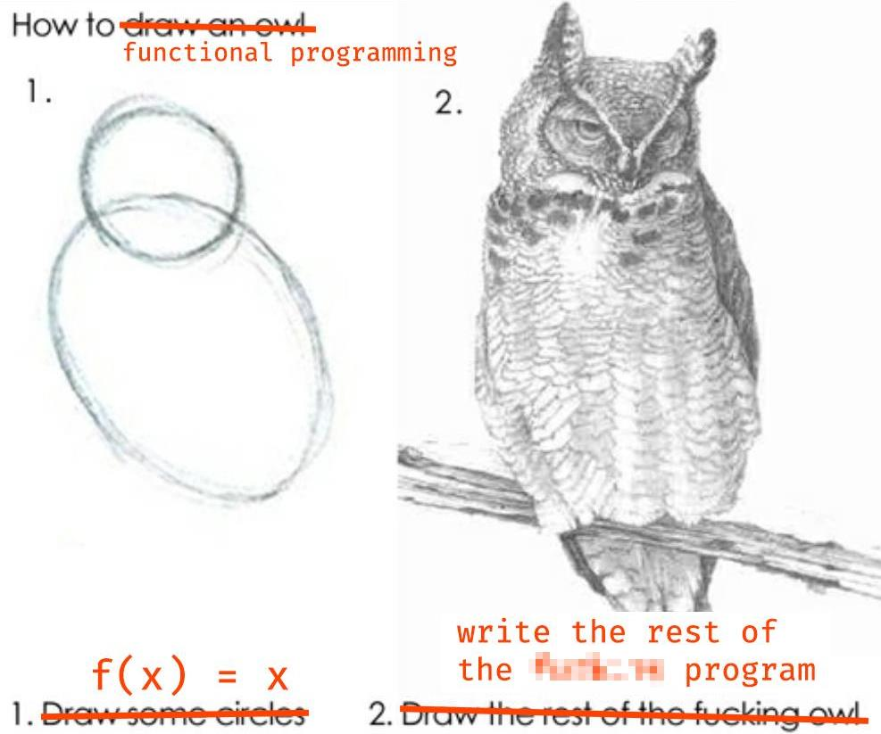
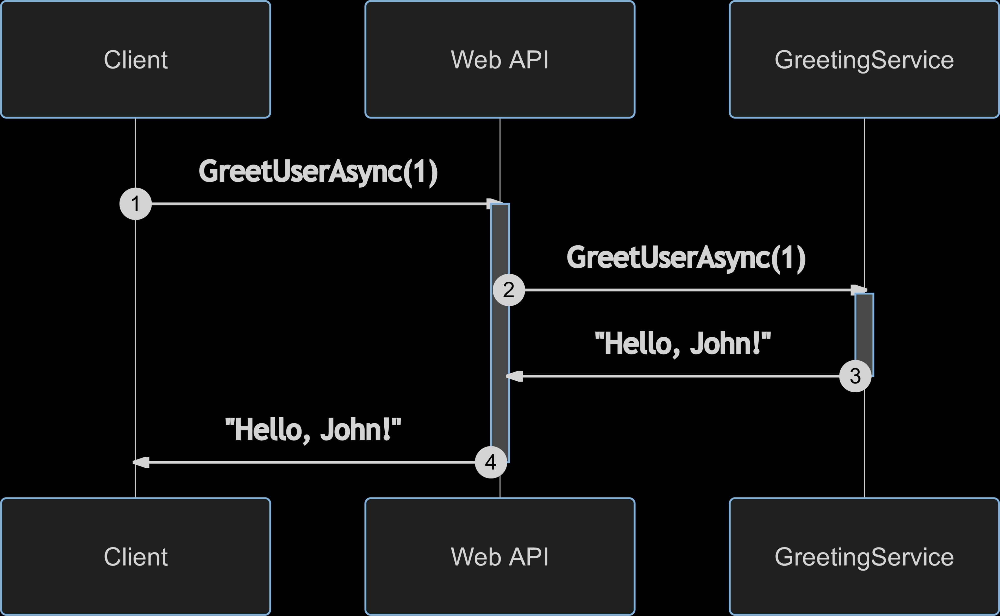
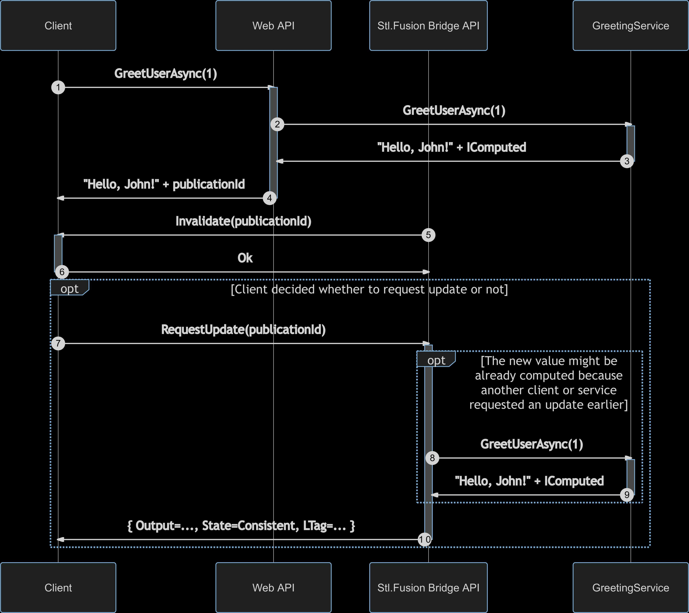

<style>
section.center {
  text-align: center;
}

section.video {
  padding: 0px;
  margin: 0px;
}
section.video iframe {
  width: 100%;
  height: 100%;
}

div.col2 {
  margin-top: 35px;
  column-count: 2;
}
div.col2 p:first-child,
div.col2 h1:first-child,
div.col2 h2:first-child,
div.col2 h3:first-child,
div.col2 ul:first-child,
div.col2 ul li:first-child,
div.col2 ul li p:first-child {
  margin-top: 0 !important;
}
div.col2 .break {
  break-before: column;
  margin-top: 0;
}
</style>


## Is real-time UI </br>really hard to code</br> or do I suck?

---
<!-- _class: video -->
<iframe src="https://www.youtube.com/embed/xJyE2QDEASA" frameborder="0" allow="accelerometer; autoplay; clipboard-write; encrypted-media; gyroscope; picture-in-picture" allowfullscreen></iframe>

---


С вами все в прорядке. Это с real-time UI все сложно.

## О чем вы узнаете:
- Какие проблемы нужно решить, чтоб сделать real-time UI?
- При чем здесь инвалидация кэша?
- Что именно делает React (и Blazor) настолько удобным?

---
# Поток данных при отображении в UI


БД и внешние сервисы
 &nbsp; &rarr; Сервисы приложения 
 &nbsp; &nbsp; &rarr; API 
 &nbsp; &nbsp; &nbsp; &rarr; Клиент 
 &nbsp; &nbsp; &nbsp; &nbsp; &rarr; UI

---


---
# UI, как композиция функций

```cs
// Client
string RenderAppUI() { 
  // Uses router, which ends up calling RenderUserName
} 

string RenderUserName(string userId) {
  var user = UserApiClient.GetUser(userId);
  return $"<div>{user.Name}</div>";
}

// API controller
UserModel GetUser(string userId) {
  var user = UserRepository.Get(string userId);
  return new UserModel(user.Id, user.Name, ...);
}

// UserRepository
User Get(string userId) { ... }
```

---
# Почему же на практике мы делаем все иначе?

1. Вычислять все заново на каждый рендер - дорого
2. Часть вызовов требуют RPC, а это еще и долго.

---
# Но постойте...

1. Вычислять все заново на каждый рендер - дорого
   <span style="color: #f44">Кеширование не для этого выдумано ли?</span>
2. Часть вызовов требуют RPC, а это еще и долго.
   <span style="color: #f44">Временно хранят на клиенте их все...<span>


---
# А что это вообще за зверь - кеширование?


Это просто временное хранение + повторное использование результата, вычисленного ранее.

<span style="color: #f44">Но ведь тогда получается, что <b>мы кешируем вообще все!</b></span>

---
# Кеширование, как higher order function

```cs
Func<TIn, TOut> ToCaching(Func<TIn, TOut> computer)
  => input => {
    var key = CreateKey(computer, input);
    if (TryGetCached(key, out var output)) return output;
    lock (GetLock(key)) { // Double-check locking
      if (TryGetCached(key, out var output)) return output;
      output = computer(input);
      StoreCached(key, output);
      return output;
    }
  }

var getUser = (Func<long, User>) (userId => UserRepository.Get(userId));
var cachingGetUser = ToCaching(getUser);
```

---
# Un problema*


**computer** в примере выше должен быть *pure function*, иначе вся наша замечательная теория превращается в тыкву!

<footer>
(*) Мелочи вроде не-async кода пока пропустим. Представим, что у нас не потоки, а goroutines.
</footer>

---
# Возможные решения*

<div class="col2">
<p>План А. Сделать чистыми все функции</p>
<p></p>

<div class="break"></div>
<p>План Б. Отслеживание зависимостей и каскадная инвалидация</p>
<p></p>
</div>

<footer>
(*) Уверен, есть и другие решения, но для них не хватило места на слайде.
</footer>

---
# План Б: зависимости + инвалидация

```cs
Func<TIn, TOut> ToAwesome(Func<TIn, TOut> computer)
  => input => {
    var key = CreateKey(computer, input);
    if (TryGetCached(key, out var computed) || Computed.IsInvalidating) 
      return computed.Use(Computed.IsInvalidating);
    lock (GetLock(key)) { 
      if (TryGetCached(key, out var computed)) 
        return computed.Use();
      
      var oldCurrent = Computed.Current;
      Computed.Current = computed = new Computed(computer, input);
      try {
        computed.Value = computer(input);
      }
      catch (Exception error) {
        computed.Error = error;
      }
      finally {
        Computed.Current = oldCurrent;
      }
      
      StoreCached(key, computed);
      return computed.Use();
    }
  }
```

---
# Computed.Use()

```cs
static TOut Use<TIn, TOut>(
    this Computed<TIn, TOut>? computed, 
    bool isInvalidating = false) 
{
  if (isInvalidating) {
    computed?.Invalidate();
    return default;
  }
  Computed.Current.AddDependency(computed);
  return computed.Value;
}
```

---
# Computed.Invalidate()

```cs
void Computed.Invalidate() 
{
  if (State == State.Invalidated) return;
  lock (this) {
    if (State == State.Invalidated) return;
    State = State.Invalidated;
    RemoveCached(Key);
    InvalidateDependants()
    OnInvalidated();
  }
}
```

---
# Статический Computed.Invalidate() - для удобства

```cs
static void Computed.Invalidate(Action action) 
{
  var oldIsInvalidating = Computed.IsInvalidating;
  Computed.IsInvalidating = true;
  try {
    action();
  }
  finally {
    Computed.IsInvalidatingent = oldIsInvalidating;
  }
}
```

---
# Caching + Dependency Tracking - пример

```cs
// Dependency
var _getUser = (Func<long, User>) (userId => UserRepository.Get(userId));
var getUser = ToAwesome(_getUser);

// Dependent function
var _getUserName = (Func<long, string>) (userId => getUser(userId).Name);
var getUserName = ToAwesome(getUserName);

var john = getUserName(johnId);
getUserName(johnId).Should().Be(john); // Unless invalidated concurrently

Computed.Invalidate(() => getUser(johnId))
john = getUserName(johnId); // Might be different
```

---
# Что мы приобрели?

* Кеширование результатов
* Отслеживание зависимостей
* Гарантию отсутствия™ бессмысленного параллельного вычисления

И все это - не меняя:
* Ни сигнатуру
* Ни реализацию ориг. функций


---
# Декоратор инкрементальной сборки ВСЕГО!

Вспомним, с чего мы начали:

1. Вычислять все заново на каждый рендер - дорого
   <span style="color: #f44">Кеширование не для этого выдумано ли?</span>

   * Но как же быть, если у нас не pure functions?
     <span style="color: #f44">Не ваша проблема это уже!</span>

2. Часть вызовов требуют RPC, а это еще и долго.
   <span style="color: #f44">Временно хранят на клиенте их все...</span> - **еще вернемся мы к тебе 😈**

---


---


<footer style="width: 100%; text-align: center;">
  <div style="font-size: 40px; color: #fff">
    Прозрачно всё - кроме Computed.Invalidate(...)
  </div>
</footer>

---
# А нужны ли нам делегаты?

Вообще-то нет. Гораздо удобнее давать эту фичу классам целиком, перекрывая часть их виртуальных методов (например, помеченных специальным атрибутом)
в сгенерированном классе-потомке.

---
# Что нужно, чтоб это заработало на практике?

* Ассинхронность - как вы знаете, она сквозная, потому
  наш синхронный вариант не жизнеспособен в принципе (ŏ̥̥̥̥ωŏ̥̥̥̥)
* GC-friendly кеш
* GC-friendly ссылки на dependants (но сильные - на dependencies)


---
<!-- _class: center -->
### Что там с eventual consistency? Где Redis?

### Что с React и Blazor?


---
<!-- _class: center -->
<div>
Есть две <b>eventually consistent</b> системы -</br>
чем они отличаются?
</div>

<div class="col2">
<h1>&nbsp;&nbsp;&nbsp;&nbsp;&nbsp;&nbsp;&nbsp;&nbsp;&nbsp;&nbsp;#1</h1>
<div class="break"></div>
<h1>#2&nbsp;&nbsp;&nbsp;&nbsp;&nbsp;&nbsp;</h1>
</div>


---


---
# Как это связано с real-time?

Для real-time нужно:
- Знать, когда результат функции меняется
  <span style="color: #f44">Инвалидация!</span>
- Вычислять новый результат быстро
  <span style="color: #f44">Инкрементальный билд!</span>
- Уметь отправлять его по сети
  <span style="color: #f44">".NET" - это же как раз про сеть, нет?</span>
- В идеале, компактным diff-ом
  <span style="color: #f44">Его так же можно вычислить
  за `O(diffSize)` для immutable types, <a href="https://medium.com/swlh/fusion-current-state-and-upcoming-features-88bc4201594b?source=friends_link&sk=375290c4538167fe99419a744f3d42d5">детали - здесь.</a></span>


---
"There are only two hard things in Computer Science: cache invalidation and naming things."
&ndash; Phil Karlton

https://martinfowler.com/bliki/TwoHardThings.html

---
# Blazor - это:

- .NET, работающий в браузере
- Работает все! 
  - `Expression.Compile(...)`, Reflection и т.п.
  - Пока нет потоков, но `Task<T>` работает (так же, как в JS)
- UI = React-like components, даже лучше!

---
# Blazor - это:

Минусы:
- Пока нет JIT / AOT - все исполняется в режиме интерпретации
- Даже небольшие проекты загружают кучу сборок.
  Есть tree shaking, но даже с ним остается 2-4 МБ сборок .NET.

---
# Blazor - это:

Плюсы:
- Это .NET, т.е. масса готового + не нужен JavaScript, TypeScript, ...
- Есть Blazor Server: UI работает на стороне сервера, на клиент идут diff-ы, которые применяются там к DOM.
- AOT и threads обещают в ближ. год. В JS threads не видать, а ядер - все больше, потому догнать и перегнать JS вполне возможно даже без JIT.
- Есть [Blazor Mobile](https://docs.microsoft.com/en-us/mobile-blazor-bindings/) - это React Native на .NET и без WASM. Пока experimental.

---


---
# Blazor - пример Razor-разметки компонента

```html
<div class="@CssClass" @attributes="@Attributes">
    <div class="card-body">
        <h5 class="card-title">
            <Icon CssClass="@IconCssClass" /> 
            @Title
        </h5>
        <div class="card-text">
            @ChildContent
        </div>
    </div>
</div>
```

---
# Blazor - результат компиляции предыдущего фрагмента

```cs
protected override void BuildRenderTree(RenderTreeBuilder __builder)
{
  __builder.OpenElement(0, "div");
  __builder.AddAttribute(1, "class", this.CssClass);
  __builder.AddMultipleAttributes(2, 
    RuntimeHelpers.TypeCheck</* ... */>(
        (IEnumerable<KeyValuePair<string, object>>) this.Attributes));
  // ...
  __builder.OpenComponent<Icon>(7);
  __builder.AddAttribute(8, "CssClass", 
    RuntimeHelpers.TypeCheck<string>(this.IconCssClass));
  __builder.CloseComponent();
  // ...
  __builder.AddContent(14, this.ChildContent);
  __builder.CloseElement();
  __builder.CloseElement();
  __builder.CloseElement();
}
```

---
# Blazor - альтернативный синтаксис

```cs
protected override void Render()
{
  var div = Element(this, 0, "div") // parent, key, type
    .SetAttributes("class", CssClass)
    .SetAttributes(Attributes)); 
  var icon = Component<Icon>(div, 7) // parent, key
    .SetAttributes("CssClass", IconCssClass));
  
  // ...
  var used = new HashSet<Component>() { div, icon, ... };
  foreach (var c in GetChildren().ToList()) {
    if (!used.Contains(c))
      c.Dispose(); // Удаляется и из Children
  }
}
```
---
# Blazor и React - так что же общего?

- Virtual DOM = такой же кеш для результатов `Component<T>(...)` & `Element(...)`
- Сache miss для `Component<T>(...)` так же приводит к его созданию
- Вызовы `SetAttributes` на `Component` приводят к вызову `Render` в конце, если атрибуты изменились или компонент еще не рендерился

## Это инкрементальный билд UI с генерацией diff-a к реальному DOM во время рендеринга.

---



---
<div class="col2">

<div class="break">

</div>

---
<!-- _class: invert-->


---
<!-- _class: center -->
# А существует ли `ToAwesome()` в реальном мире?


---
<!-- _class: center -->


---
# Пример сервиса Fusion

```cs
public class CounterService
{
  private volatile int _count;

  [ComputeMethod]
  public virtual async Task<int> GetCountAsync()
    => _count;

  [ComputeMethod]
  public virtual async Task<string> GetCountTextAsync() 
    => (await GetCountAsync()).ToString();

  public async Task IncrementCountAsync()
  {
    Interlocked.Increment(ref _count);
    Computed.Invalidate(() => GetCountAsync());
  }
}
```

---
# `IComputed<T>` из Stl.Fusion

Упрощенная версия:
```cs
interface IComputed<T> {
  // Computing -> Consistent -> Invalidated
  ConsistencyState ConsistencyState { get; } 
  T Value { get; }
  Exception Error { get; }
  
  event Action Invalidated; // Event, triggered just once on invalidation
  void Invalidate();
  Task<IComputed<T>> UpdateAsync();
}
```


---


---
<!-- _class: center -->

<div style="font-size: 100px; color: #eee; text-shadow: 2px 2px #000;">
  <a href="http://fusion-samples.servicetitan.com/" 
     style="color: #eee">DEMO</a>
</div>

<footer>
  <a href="http://fusion-samples.servicetitan.com/"
     style="background: white; padding: 3pt;">https://fusion-samples.servicetitan.com</a>
</footer>


---
# Реплики и вызовы по сети

```cs
public class ReplicaComputed<T> : IComputed<T> 
{
    ConsistencyState ConsistencyState { get; }
    T Value { get; }
    Exception Error { get; }
    event Action Invalidated;
    
    public ReplicaComputed<T>(IComputed<T> source) 
    {
        source.ThrowIfComputing();
        Value = source.Value;
        ConsistencyState = source.ConsistencyState;
        source.Invalidated += () => Invalidate();
    }

    // ...
}
```

---



---



---
# `ComposerService` - пример сервиса-агрегатора

Он же live: https://fusion-samples.servicetitan.com/composition
Исходный код: [ComposerService](https://github.com/servicetitan/Stl.Fusion.Samples/blob/master/src/Blazor/Server/Services/ComposerService.cs), [LocalComposerService](https://github.com/servicetitan/Stl.Fusion.Samples/blob/master/src/Blazor/Client/Services/LocalComposerService.cs).

```cs
public virtual async Task<ComposedValue> GetComposedValueAsync(
    string parameter, Session session)
{
  var chatTail = await ChatService.GetChatTailAsync(1);
  var uptime = await TimeService.GetUptimeAsync(TimeSpan.FromSeconds(10));
  var sum = (double?) null;
  if (double.TryParse(parameter, out var value))
      sum = await SumService.SumAsync(new [] { value }, true);
  var lastChatMessage = chatTail.Messages.SingleOrDefault()?.Text 
    ?? "(no messages)";
  var user = await AuthService.GetUserAsync(session);
  var activeUserCount = await ChatService.GetActiveUserCountAsync();
  return new ComposedValue(
    $"{parameter} - server", uptime, sum, 
    lastChatMessage, user, activeUserCount);
}
```

---
# Насколько эффективно кеширование Fusion?

Метод, который мы будем вызывать в тесте:
```cs
public virtual async Task<User?> TryGetAsync(long userId)
{
  await Everything(); // Кто уже понял, чем этот вызов полезен?
  await using var dbContext = DbContextFactory.CreateDbContext();
  // DbContextFactory зарегистрирована с AddPooledDbContextFactory
  var user = await dbContext.Users.FindAsync(new[] {(object) userId});
  return user;
}
```
---
# Насколько эффективно кеширование Fusion?

Читалка - их в тесте 3 на ядро:
```cs
async Task<long> Reader(string name, int iterationCount)
{
    // IUserProvider users захватывается замыканием
    var rnd = new Random();
    var count = 0L;
    for (; iterationCount > 0; iterationCount--) {
        var userId = (long) rnd.Next(UserCount);
        var user = await users.TryGetAsync(userId);
        if (user!.Id == userId)
            count++;
        extraAction.Invoke(user!); // + Сериализация
    }
    return count;
}
```
Еще есть похожий `Mutator`, его выполняет один поток.

---
# Насколько эффективно кеширование Fusion?

Sqlite EF provider: **16070x**
<div class="col2" style="margin-top: 0px;">
<pre>
With Stl.Fusion:
  Standard test:
    Speed:      35708.280 K Ops/sec
  Standard test + serialization:
    Speed:      12481.940 K Ops/sec
</pre>
<div class="break"></div>
<pre>
Without Stl.Fusion:
  Standard test:
    Speed:      2.222 K Ops/sec
  Standard test + serialization:
    Speed:      2.179 K Ops/sec
</pre>
</div>

In-memory EF provider: **1140x**
<div class="col2" style="margin-top: 0px;">
<pre>
With Stl.Fusion:
  Standard test:
    Speed:      30338.256 K Ops/sec
  Standard test + serialization:
    Speed:      11789.282 K Ops/sec
</pre>
<div class="break"></div>
<pre>
Without Stl.Fusion:
  Standard test:
    Speed:      26.553 K Ops/sec
  Standard test + serialization:
    Speed:      26.143 K Ops/sec
</pre>
</div>

И это только первый уровень, т.е. нет никакого incremental build!

---
# Fusion's Caching Sample

Такой же Web API endpoint: 20,000 → 130,000 RPS, или **6.5x**

```text
RestEase Client -> ASP.NET Core -> EF Core Service:
  Reads: 20.46K operations/s

RestEase Client -> ASP.NET Core -> Fusion Proxy -> EF Core Service:
  Reads: 127.96K operations/s

Fusion's Replica Client:
  Reads: 20.29M operations/s
```

---
<!-- _class: video -->
<iframe src="https://www.youtube.com/embed/05pzUXujMJU?start=186" frameborder="0" allow="accelerometer; autoplay; clipboard-write; encrypted-media; gyroscope; picture-in-picture" allowfullscreen></iframe>

---
<!-- _class: video -->
<iframe src="https://www.youtube.com/embed/lzP0JIzrYmM?start=24" frameborder="0" allow="accelerometer; autoplay; clipboard-write; encrypted-media; gyroscope; picture-in-picture" allowfullscreen></iframe>

---
<!-- _class: center invert-->

## Почему real-time - это важно?

---


---
<!-- _class: center invert-->

<br><br><br><br>
<h2 style="font-size: 60pt">СПАСИБО!</h1>

<footer style="width: 95%; text-align: right; font-size: 20pt; color: white">
Александр Якунин</br>
Автор Fusion, CTO в <a href="https://www.servicetitan.com/">ServiceTitan, Inc.</a></br>
<a href="https://github.com/servicetitan/Stl.Fusion">https://github.com/servicetitan/Stl.Fusion</a></br>
Специально для <a href="https://eventskbkontur.timepad.ru/events/">Kontur Tech Talks</a>
</footer>


