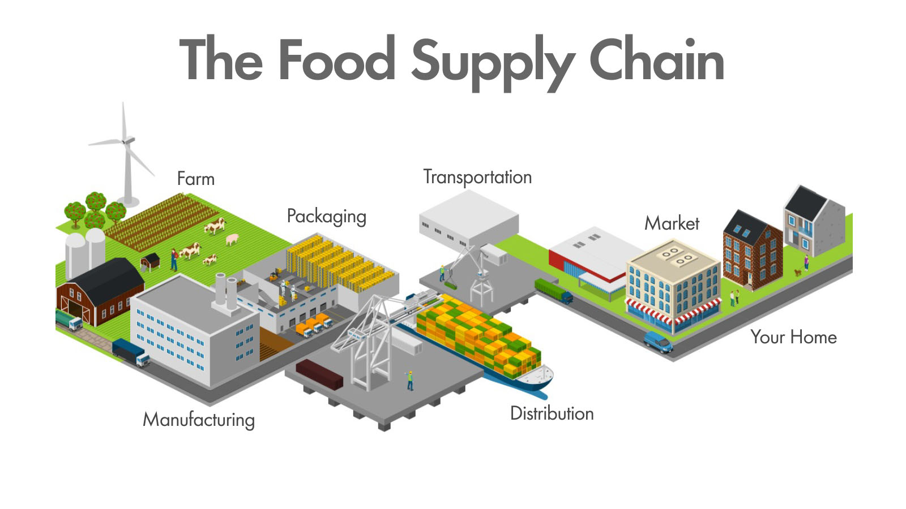

<style>
section.video {
  padding: 0px;
  margin: 0px;
}
section.video iframe {
  width: 100%;
  height: 100%;
}

div.col2 {
  margin-top: 35px;
  column-count: 2;
}
div.col2 p:first-child,
div.col2 h1:first-child,
div.col2 h2:first-child,
div.col2 h3:first-child,
div.col2 ul:first-child,
div.col2 ul li:first-child,
div.col2 ul li p:first-child {
  margin-top: 0 !important;
}
div.col2 .break {
  break-before: column;
  margin-top: 0;
}
</style>

## Is real-time UI </br>really hard to code</br> or do I suck?


---
<!-- _class: video -->
<iframe src="https://www.youtube.com/embed/xJyE2QDEASA" frameborder="0" allow="accelerometer; autoplay; clipboard-write; encrypted-media; gyroscope; picture-in-picture" allowfullscreen></iframe>

---
# Поток данных при отображении в UI


БД и внешние сервисы
 &nbsp; &rarr; Сервисы приложения 
 &nbsp; &nbsp; &rarr; API 
 &nbsp; &nbsp; &nbsp; &rarr; Клиент 
 &nbsp; &nbsp; &nbsp; &nbsp; &rarr; UI

---



---
# UI, как композиция функций

```cs
// Client
string RenderAppUI() { 
  // Uses router, which ends up calling RenderUserName
} 

string RenderUserName(string userId) {
  var user = UserApiClient.GetUser(userId);
  return $"<div>{user.Name}</div>";
}

// API controller
UserModel GetUser(string userId) {
  var user = UserRepository.Get(string userId);
  return new UserModel(user.Id, user.Name, ...);
}

// UserRepository
User Get(string userId) { ... }
```

---
# Так, а почему в реальности мы делаем все иначе?

1. Вычислять все заново на каждый рендер - дорого
2. Часть вызовов требуют RPC, т.е. это еще и долго.
