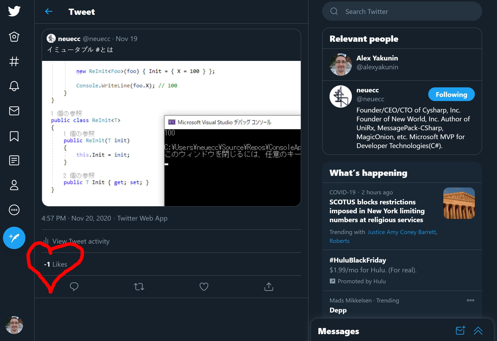
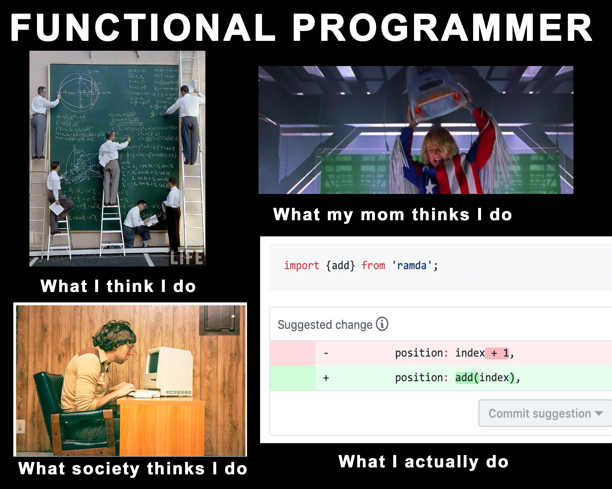
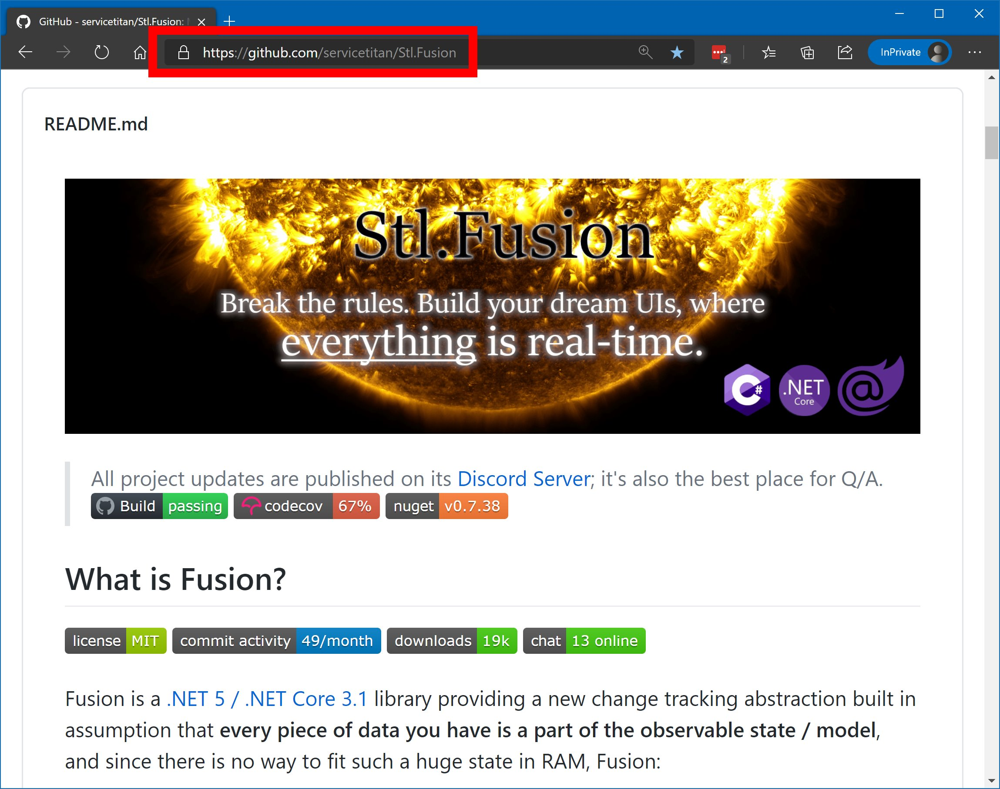
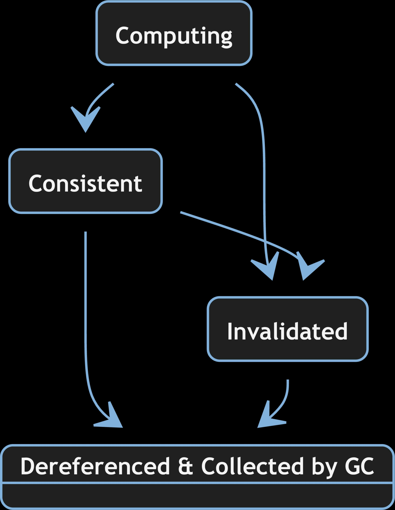
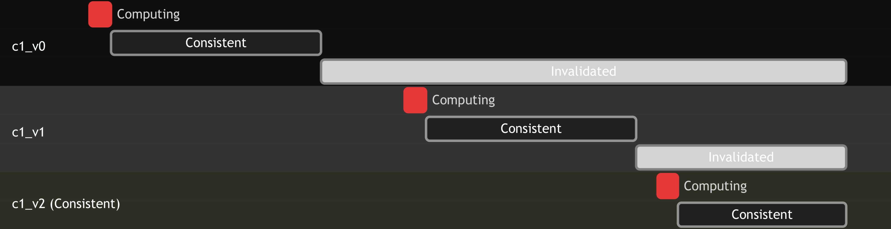
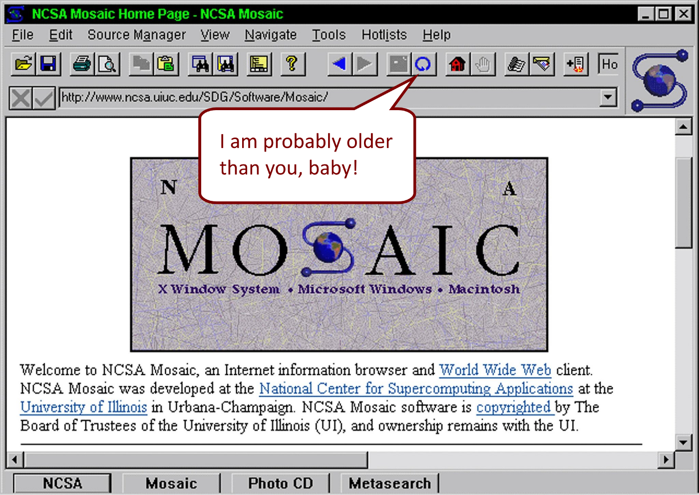

<style>
section tt { font-weight: bold; }
section span.hljs-string { color: #50b050; }
section span.hljs-title { color: #7ff2e1; }
section span.hljs-number { color: #00acc5; }

section.highlight em { color: #aff; font-style: normal; }
section.highlight strong { color: #f44; font-style: normal; font-weight: normal; }

section.center {
  text-align: center;
}

section.video {
  padding: 0px;
  margin: 0px;
}
section.video iframe {
  width: 100%;
  height: 100%;
}

div.col2 {
  margin-top: 35px;
  column-count: 2;
}
div.col2 p:first-child,
div.col2 h1:first-child,
div.col2 h2:first-child,
div.col2 h3:first-child,
div.col2 ul:first-child,
div.col2 ul li:first-child,
div.col2 ul li p:first-child {
  margin-top: 0 !important;
}
div.col2 .break {
  break-before: column;
  margin-top: 0;
}
</style>


## Is real-time UI </br>really hard to code</br> or do I suck?

---


---
<!-- _class: highlight invert-->


## You'll learn:
- What do you need to have a good *real-time UI*?
- How real-time is related to *cache invalidation and eventual consistency*?
- What really makes *React and Blazor* so convenient?
- How all of this is related to *functional programming*?
- And many other things...

---

# Typical Real-time UI Data Flow


**Reads:** UI &larr; Client &larr; API &larr; Services &larr; DB & other storages
**Updates**:
- UI must subscribe to (and unsubscribe from!) domain events (error prone)
- These events must be transformed to UI model changes (breaks DRY)
- The UI displaying these models must be updated
- Server-side code must implement event sourcing / CQRS
- ... a lot more ...

### But the main downside is:
Your UI becomes implicitly dependent on the server-side change processing logic. It accumulates more and more knowledge of which models & parts of the UI are impacted by which changes.

---


---
# UI as a Composition of Functions

```cs
// Client
string RenderAppUI() { 
  // Uses router, which ends up calling RenderUserName
} 

string RenderUserName(string userId) {
  var user = UserApiClient.GetUser(userId);
  return $"<div>{user.Name}</div>";
}

// API controller
UserModel GetUser(string userId) {
  var user = UserRepository.Get(string userId);
  return new UserModel(user.Id, user.Name, ...);
}

// UserRepository
User Get(string userId) { ... }
```

---
<!-- _class: highlight invert-->
# Why don't we use this approach?

1. It's quite expensive to recompute everything on every update
2. And quite time consuming, because a part of these functions require RPC.

---
<!-- _class: highlight invert-->
# But wait...

1. It's quite expensive to recompute everything on every update
   **Cache use you must?**
2. And quite time consuming, because a part of these functions require RPC.
   **Client-side cache use you must?**


---
<!-- _class: highlight invert-->
# To Cache


means to store and reuse the results of computations executed in past.

**Do we cache everything?**

---
# Caching as a Higher Order Function

```cs
Func<TIn, TOut> ToCaching<TIn, TOut>(Func<TIn, TOut> computer)
  => input => {
    var key = CreateKey(computer, input);

    if (TryGetCached(key, out var output)) return output;
    lock (GetLock(key)) { // Double-check locking
      if (TryGetCached(key, out var output)) return output;

      output = computer(input);
      StoreCached(key, output);

      return output;
    }
  }

var getUser = (Func<long, User>) (userId => UserRepository.Get(userId));
var cachingGetUser = ToCaching(getUser);
```

---
# A Small Problem*


The code you saw works only when <tt>computer</tt> is a *pure function*.

So you just saw a tiny example of vaporware.

<footer>
(*) Let's omit all minor issues for now &ndash; such as the fact it's non-async code.
</footer>

---
# Solutions*

<div class="col2">
<p><b>Plan 😈:</b> Purify every function!</p>
<p></p>

<div class="break"></div>
<p><b>Plan 🙀:</b> Implement dependency tracking + cascading invalidation </p>
<p></p>
</div>

<footer>
(*) I'm absolutely sure there are other solutions. But there is no more space on this slide, so...
</footer>

---
# Plan 🙀: Caching + Dependency Tracking + Invalidation

```cs
Func<TIn, TOut> ToAwesome<TIn, TOut>(Func<TIn, TOut> computer)
  => input => {
    var key = CreateKey(computer, input);
    if (TryGetCached(key, out var computed) || Computed.IsInvalidating) // [ThreadStatic]
      return computed.UseOrInvalidate();
    lock (GetLock(key)) { 
      if (TryGetCached(key, out var computed)) 
        return computed.Use();
      
      var oldCurrent = Computed.Current; // [ThreadStatic]
      Computed.Current = computed = new Computed(computer, input, key);
      try {
        computed.Value = computer(input);
      }
      catch (Exception error) {
        computed.Error = error;
      }
      finally {
        Computed.Current = oldCurrent;
      }
      
      StoreCached(key, computed);
      return computed.Use();
    }
  }
```

---
# Invalidation logic: `Computed.Invalidate()`

```cs
public void Invalidate() 
{
  if (State == State.Invalidated) return;
  lock (this) { // Double-check locking
    if (State == State.Invalidated) return;
    State = State.Invalidated;
    RemoveCached(Key);
    InvalidateDependants(); // Calls 
    OnInvalidated();
  }
}
```

---
# Registering a dependency: `Computed.Use()`

```cs
static TOut Use<TIn, TOut>(this Computed<TIn, TOut> computed)
{
  Computed.Current.AddDependency(computed);
  return computed.Value;
}

static TOut UseOrInvalidate<TIn, TOut>(this Computed<TIn, TOut>? computed)
{
  if (Computed.IsInvalidating) { // [ThreadStatic]
    computed?.Invalidate();
    return default;
  }
  return computed.Use();
}
```

---
## A convenience helper: static `Computed.Invalidate(...)`
```cs
static void Computed.Invalidate(Action action) 
{
  var oldIsInvalidating = Computed.IsInvalidating;
  Computed.IsInvalidating = true;
  try {
    action();
  }
  finally {
    Computed.IsInvalidating = oldIsInvalidating;
  }
}
```

---
# Caching + Dependency Tracking Example

```cs
var counters = new Dictionary<string, int>();
 
// Dependency
var getCounter = ToAwesome((Func<string, int>) (key
  => counters.GetValueOrDefault(key)));

// Dependent function
var getCounterText = ToAwesome((Func<long, string>) (key
  => $"Count: {GetCounter(key)}"));

WriteLine(getCounterText("A")); // "Count: 0" - invokes both delegates
WriteLine(getCounterText("A")); // "Count: 0" - cache hit for getCounterText("A")

counters["A"] = 1;
Computed.Invalidate(() => getCounter("A")) // Invalidates both cached values
WriteLine(getCounterText("A")); // "Count: 1" - invokes both delegates again
```

---
<!-- _class: highlight invert-->
# Our new superpowers:
* *Call result caching*
* *Dependency tracking*
* *The same value is never computed concurrently*

And it does this *without changing neither the signature, nor the implementation* of a function it gets!

> "So, tell me, my little one-eyed one, on what poor, pitiful, defenseless planet has my monstrosity been unleashed?"
> &ndash; [Dr. Jumba Jookiba](https://disney.fandom.com/wiki/Jumba_Jookiba), #1 scientist in my list


---
<!-- _class: highlight invert-->
# The Incrementally-Build-EVERYTHING Decorator!

Let's remember where we started:

1. It's quite expensive to recompute everything on every update
   **Cache use you must?**
   * But what if some of our functions are impure?
     *Not a problem this is anymore!*
2. And quite time consuming, because a part of these functions require RPC.
   **Client-side cache use you must?**
   *We'll get back to this part later.*


---


---


<footer style="width: 100%; text-align: center;">
  <div style="font-size: 48px; color: #fff">
    A transparent <strike>furniture</strike> abstraction!*
    <div style="font-size: 24px; color: #fff">
      (*) Except <tt>Computed.Invalidate</tt> &ndash; nothing is prefect :(
    </div>
  </div>
</footer>

---
# Do we really need this syntax with delegates?

We don't. It's actually much more convenient to apply this decorator to virtual methods tagged by a special attribute by generating a proxy type in runtime that overrides them.


---
# What else is missing?

- Actual implementation of a "box"
- Async support
- GC-friendly "box" cache
- GC-friendly refs to dependants
- A lot more. But slides are to show the bright side of things, right?


---
<!-- _class: center -->
### What about eventual consistency?

### What about React and Blazor?


---
<!-- _class: highlight invert -->
## Flash Slothmore is eventually consistent:

He will close all of his tasks-in-slow-progress *eventually*.
*Once* [Judy Hopps](https://zootopia.fandom.com/wiki/Judy_Hopps) stops distracting him with her problems 
(stops giving him more tasks).


---
<!-- _class: highlight invert -->
<h2>
&ndash; Bro, do you have a cache?</br>
&ndash; I do - but it's so tiny...</br>
&ndash; We are doomed! The state is eventually consistent!
</h2>


---
<!-- _class: center -->
<div>
Imagine two <b>eventually consistent</b> systems -</br>
what's their key difference?
</div>

<div class="col2">
<h1>&nbsp;&nbsp;&nbsp;&nbsp;&nbsp;&nbsp;&nbsp;&nbsp;&nbsp;&nbsp;#1</h1>
<div class="break"></div>
<h1>#2&nbsp;&nbsp;&nbsp;&nbsp;&nbsp;&nbsp;</h1>
</div>


---


---
# I'm in the real-time business. How this is relevant?
<!-- _class: highlight invert -->

Real-time updates require you to:
- Know when a result of a function changes
  **Invalidate all the things!**
- Recompute new results quickly
  **Incrementally build all the things!**
- Send them over the network
  *.NET all the things?
- Ideally, as a compact diff to the prev. state
  **Diff can be computed in `O(diffSize)` for immutable types (<a href="https://medium.com/swlh/fusion-current-state-and-upcoming-features-88bc4201594b?source=friends_link&sk=375290c4538167fe99419a744f3d42d5">details</a>).</span>**


---
<!-- _class: highlight invert -->
*"There are only two hard things in Computer Science: **cache invalidation** and **naming things**."*
&ndash; Phil Karlton

</br>

Naming problem is of the same scale as the Ultimate Question of Life, the Universe, and Everything, so... Good we've made a meaningful progress with a simpler one!

<footer>
A  collection of other "two things in computer science" memes: <a href="https://martinfowler.com/bliki/TwoHardThings.html">https://martinfowler.com/bliki/TwoHardThings.html</a>
</footer>

---


---
# Blazor is:

- .NET running in your browser
- Nearly 100% compatibility with .NET 5! 
  - `Expression.Compile(...)`, Reflection, etc. works
  - No threads yet, but `Task<T>` works
- Blazor UI Components ≃ React Components, but with .NET bells and whistles!

<footer>
Blazor fans, see the image of the Blazor God!</br>
Coincidentally, <a href="https://twitter.com/StevenSanderson">Mr. Sanderson</a> is also the creator of <a href="https://knockoutjs.com/">Knockout.js.</a>
</footer>


---


---
# Blazor &ndash; cons:

- No JIT / AOT compilation yet - in fact, everything is interpreted
- It's .NET, so even a tiny project loads a fair number of assemblies.
  There is linking with tree shaking, but even it leaves 2…4 MB of .dlls.

---
# Blazor &ndash; pros:
<!-- _class: highlight invert -->

- .NET = so many ready-to-use NuGet packages + no need for JS, TS, etc.
- .dlls are loaded once & stored in application cache. 
  They aren't updated even on `F5` &ndash; unless you explicitly clear it.
- [Blazor Server](https://docs.microsoft.com/en-us/aspnet/core/blazor/hosting-models?view=aspnetcore-5.0) helps to mitigate this by further letting your UI code to run on server side (e.g. for slow mobile devices). The JS payload is tiny in this case.
- AOT and threads are expected in 2021. 
  **JS won't get threads - ever. CPU core count is increasing. So I bet in 1-2 years WASM (and Blazor) will be #1 choice for truly responsive UI.**
- There is experimental [Blazor Mobile](https://docs.microsoft.com/en-us/mobile-blazor-bindings/): like [React Native](https://reactnative.dev/), but relying on Blazor compontens and native .NET runtime on each platform.

---
## Blazor Components - UI markup example

```html
<div class="@CssClass" @attributes="@Attributes">
    <div class="card-body">
        <h5 class="card-title">
            <Icon CssClass="@IconCssClass" /> 
            @Title
        </h5>
        <div class="card-text">
            @ChildContent
        </div>
    </div>
</div>
```

---
## Blazor Components - compiled version of above markup

```cs
protected override void BuildRenderTree(RenderTreeBuilder __builder)
{
  __builder.OpenElement(0, "div");
  __builder.AddAttribute(1, "class", this.CssClass);
  __builder.AddMultipleAttributes(2, 
    RuntimeHelpers.TypeCheck</* ... */>(
        (IEnumerable<KeyValuePair<string, object>>) this.Attributes));
  // ...
  __builder.OpenComponent<Icon>(7);
  __builder.AddAttribute(8, "CssClass", 
    RuntimeHelpers.TypeCheck<string>(this.IconCssClass));
  __builder.CloseComponent();
  // ...
  __builder.AddContent(14, this.ChildContent);
  __builder.CloseElement();
  __builder.CloseElement();
  __builder.CloseElement();
}
```

---
## Blazor Components - the same markup, functional style

```cs
protected override HashSet<Component> RenderChildren()
{
  var div = Element(this, 0, "div") // parent, key, type
    .SetAttributes("class", CssClass)
    .SetAttributes(Attributes)); 
  var icon = Component<Icon>(div, 7) // parent, key
    .SetAttributes("CssClass", IconCssClass));
  // ...
  return new new HashSet<Component>() { div, icon, ... };
}

protected void Render()
{
  var newChildren = RenderChildren();
  foreach (var c in Children.ToHashSet().ExceptWith(newChildren))
      c.Dispose();
  foreach (var c in newChildren)
      c.TryRender();
}

```
---
# Blazor and React - so what's common there?

- Virtual DOM = the result cache for `Component<T>(...)` & `Element(...)` calls:
  - Сache miss = build a component
  - Cache hit = reuse the exiting one, + maybe rebuild its own Virtual DOM
- `TryRender()` calls `Render()` for every component that changed after its last `Render()` call.

</br>
</br>
<div style="text-align: center">
<h2 style="margin: 0px">
  All in all, <strong>React and Blazor = an incremental builder for your UI!</strong>
</h2>
<div style="margin: 0px">
  Just specialized to produce a diff to apply to the real DOM or UI controls.
</div>

---



---
<div class="col2">

<div class="break">

</div>

---
<!-- _class: invert-->


---
<!-- _class: center -->
# Does `ToAwesome()` really exist?


---
<!-- _class: center -->



---
# Fusion Service Example

```cs
public class CounterService
{
  private volatile int _count;

  [ComputeMethod]
  public virtual async Task<int> GetCountAsync()
    => _count;

  [ComputeMethod]
  public virtual async Task<string> GetCountTextAsync() 
    => (await GetCountAsync()).ToString();

  public async Task IncrementCountAsync()
  {
    Interlocked.Increment(ref _count);
    Computed.Invalidate(() => GetCountAsync());
  }
}
```

---
# Fusion's `IComputed<T>`:

Below is a simplified version of "a box" storing call result, its dependencies, dependants, etc.:
```cs
interface IComputed<T> {
  // Computing -> Consistent -> Invalidated
  ConsistencyState ConsistencyState { get; } 
  T Value { get; }
  Exception Error { get; }
  
  event Action Invalidated; // Event, triggered just once on invalidation
  void Invalidate();
  Task<IComputed<T>> UpdateAsync();
}
```



---



---
<!-- _class: center -->

<div style="font-size: 100px; color: #eee; text-shadow: 2px 2px #000;">
  <a href="http://fusion-samples.servicetitan.com/" 
     style="color: #eee">DEMO</a>
</div>

<footer>
  <a href="http://fusion-samples.servicetitan.com/"
     style="background: white; padding: 3pt;">https://fusion-samples.servicetitan.com</a>
</footer>


---
# Can we *replicate* `IComputed` on a remote host?

```cs
public class ReplicaComputed<T> : IComputed<T> 
{
    ConsistencyState ConsistencyState { get; }
    T Value { get; }
    Exception Error { get; }
    event Action Invalidated;
    
    public ReplicaComputed<T>(IComputed<T> source) 
    {
        source.ThrowIfComputing();
        (Value, Error) = (source.Value, source.Error);
        ConsistencyState = source.ConsistencyState;
        source.Invalidated += () => Invalidate();
    }

    // ...
}
```

Do the same, but deliver the invalidation event via RPC.

---
# Your Web API call:
<!-- _class: highlight invert -->

&rarr; How's my app doing?
&larr; Still alive. 

**1 request = 1 response.**


---
# Fusion API call:
<!-- _class: highlight invert -->

&rarr; How's my app doing? *+publish*
&larr; Still alive. *+watch pub-666*
*&larr; Be brave, pub-666 is... Invalidated.*

**1 request = 1 or 2 responses, 
the 2nd one might come much later.** 

The invalidation notifications are delivered via Publisher-Replicator channel. Fusion uses WebSocket connection for such channels now, but more options to be available *eventually*.


---
## `ComposerService` - an example service relying on remote replicas

See it live: https://fusion-samples.servicetitan.com/composition
Source code: [ComposerService](https://github.com/servicetitan/Stl.Fusion.Samples/blob/master/src/Blazor/Server/Services/ComposerService.cs), [LocalComposerService](https://github.com/servicetitan/Stl.Fusion.Samples/blob/master/src/Blazor/UI/Services/LocalComposerService.cs).

```cs
public virtual async Task<ComposedValue> GetComposedValueAsync(
    string parameter, Session session)
{
  // Fusion magic: all these seemingly RPC call complete instantly w/o
  // a real RPC while the result they produce is known to be consistent.
  var chatTail = await ChatService.GetChatTailAsync(1);
  var uptime = await TimeService.GetUptimeAsync(TimeSpan.FromSeconds(10));
  var sum = (double?) null;
  if (double.TryParse(parameter, out var value))
      sum = await SumService.SumAsync(new [] { value }, true);
  var lastChatMessage = chatTail.Messages.SingleOrDefault()?.Text ?? "(no messages)";
  var user = await AuthService.GetUserAsync(session);
  var activeUserCount = await ChatService.GetActiveUserCountAsync();
  return new ComposedValue(
    $"{parameter} - server", uptime, sum, 
    lastChatMessage, user, activeUserCount);
}
```

---

A real Blazor component that updates in real-time:
```cs
@inherits LiveComponentBase<ActiveTranscriptions.Model>
@using System.Threading
@using ServiceTitan.Speech.Abstractions
@inject ITranscriber Transcriber

@{
    var state = State.LastValue; // We want to show the last correct model on error
    var error = State.Error;
}

<DataGrid TItem="Transcript"
          Data="@state.Transcripts"
          TotalItems="@state.Transcripts.Length"
          Sortable="false"
          ShowPager="false">
    <DataGridCommandColumn TItem="Transcript"/>
    <DataGridColumn TItem="Transcript" Field="@nameof(Transcript.Id)" Caption="#"/>
    <DataGridColumn TItem="Transcript" Field="@nameof(Transcript.StartTime)" Caption="Start Time"/>
    <DataGridColumn TItem="Transcript" Field="@nameof(Transcript.Duration)" Caption="Duration"/>
    <DataGridColumn TItem="Transcript" Field="@nameof(Transcript.Text)" Caption="Text" Width="75%" />
</DataGrid>

@code {
    public class Model
    {
        public Transcript[] Transcripts { get; set; } = Array.Empty<Transcript>();
    }

    protected override void ConfigureState(LiveState<Model>.Options options)
        // Update delays are configurable per-state / per-component
        => options.WithUpdateDelayer(o => o.Delay = TimeSpan.FromSeconds(1));

    protected override async Task<Model> ComputeStateAsync(CancellationToken cancellationToken)
    {
        var transcriptIds = await Transcriber.GetActiveTranscriptionIdsAsync(cancellationToken);
        var transcriptTasks = transcriptIds.Select(id => Transcriber.GetAsync(id, cancellationToken));
        var transcripts = await Task.WhenAll(transcriptTasks); // Get them all in parallel!
        return new Model() { Transcripts = transcripts };
    }
}
```

---
# How efficient is Fusion caching?

The method we're repeatedly calling in our [performance test](https://github.com/servicetitan/Stl.Fusion/blob/master/tests/Stl.Fusion.Tests/PerformanceTest.cs):
```cs
public virtual async Task<User?> TryGetAsync(long userId)
{
  await Everything(); // LMK if you know what's the role of this call!
  await using var dbContext = DbContextFactory.CreateDbContext(); // Pooled
  var user = await dbContext.Users.FindAsync(new[] {(object) userId});
  return user;
}
```
---
# How efficient is Fusion caching?

The `Reader` async task (the test runs 3 readers per core):
```cs
async Task<long> Reader(string name, int iterationCount)
{
    var rnd = new Random();
    var count = 0L;
    for (; iterationCount > 0; iterationCount--) {
        var userId = (long) rnd.Next(UserCount);
        var user = await users.TryGetAsync(userId);
        if (user!.Id == userId)
            count++;
        extraAction.Invoke(user!); // Optionally serializes the user
    }
    return count;
}
```
There is also a similar `Mutator`, but only one instance of it is running.

---
# How efficient is Fusion caching?
<!-- _class: highlight invert -->

Sqlite EF provider: **16,070x**
<div class="col2" style="margin-top: 0px;">
<pre>
With Stl.Fusion:
  Standard test:
    Speed:      35708.280 K Ops/sec
  Standard test + serialization:
    Speed:      12481.940 K Ops/sec
</pre>
<div class="break"></div>
<pre>
Without Stl.Fusion:
  Standard test:
    Speed:      2.222 K Ops/sec
  Standard test + serialization:
    Speed:      2.179 K Ops/sec
</pre>
</div>

In-memory EF provider: **1,140x**
<div class="col2" style="margin-top: 0px;">
<pre>
With Stl.Fusion:
  Standard test:
    Speed:      30338.256 K Ops/sec
  Standard test + serialization:
    Speed:      11789.282 K Ops/sec
</pre>
<div class="break"></div>
<pre>
Without Stl.Fusion:
  Standard test:
    Speed:      26.553 K Ops/sec
  Standard test + serialization:
    Speed:      26.143 K Ops/sec
</pre>
</div>

And that's just a plain caching, i.e. no any extra benefits from the "incremental build for everything" that Fusion adds!

---
# Fusion's Caching Sample
<!-- _class: highlight invert -->

A very similar code, but exposing the service via Web API. The results: 
- 20,000 → 130,000 RPS = **6.5x throughput**
  With server-side changes only, i.e. the same client.
- 20,000 → 20,000,000 RPS = **1000x throughput!**  
  If you switch to Fusion client (so-called ["Replica Service"](https://github.com/servicetitan/Stl.Fusion.Samples/blob/master/docs/tutorial/Part04.md))

```text
RestEase Client -> ASP.NET Core -> EF Core Service:
  Reads: 20.46K operations/s

RestEase Client -> ASP.NET Core -> Fusion Proxy -> EF Core Service:
  Reads: 127.96K operations/s

Fusion's Replica Client:
  Reads: 20.29M operations/s
```

---
<!-- _class: center invert-->

## How 10x speed boost looks like?

---
<!-- _class: video -->
<iframe src="https://www.youtube.com/embed/05pzUXujMJU?start=186" frameborder="0" allow="accelerometer; autoplay; clipboard-write; encrypted-media; gyroscope; picture-in-picture" allowfullscreen></iframe>

---
<!-- _class: video -->
<iframe src="https://www.youtube.com/embed/lzP0JIzrYmM?start=24" frameborder="0" allow="accelerometer; autoplay; clipboard-write; encrypted-media; gyroscope; picture-in-picture" allowfullscreen></iframe>

---
## What do you get with Fusion?
<!-- _class: highlight invert -->

**The feeling of flight:**
- Caching - with automatic dependency tracking and cascading invalidation
- The same value is never computed concurrently
- But: all `[ComputeMethod]`-s can run concurrently!


---
## What do you get with Fusion?
<!-- _class: highlight invert -->

**The feeling of awesomeness** of your clean code:
* *You describe the substance.*
  "That's what I want to get"
* *Fusion allows you to express this substance in the clean form.*
  By ensuring you get what you want as efficiently as possible.

Just imagine, Fusion's Replica Services resolve 99.9% of your RPC calls locally, but still produce the right answers. And to achieve that, they span the web of their invalidation chains across multiple servers. Awesome, right?


---
## What do you get with Fusion?
<!-- _class: highlight invert -->

**The feeling of laziness:** you get all of that with almost zero changes in code!

</br>

> Just add <strike>water</strike> `Computed.Invalidate(...)`.
> &ndash; AY, Fusion's creator


---
## What do you get with Fusion?
<!-- _class: highlight invert -->

**The feeling of ultimate super power** (together with Blazor):

- You can run Fusion services on the client too!
- Moreover, Fusion includes `LiveComponent` - a base base type for your Blazor components that has everything you need for real-time updates!
- So you don't need a Knockout or MobX alternative for Blazor. Just use Fusion - everywhere!

Moreover, if you use the same interfaces for your Fusion services and their client-side replicas, your UI code will run equally well on the server side too! This is what allows Fusions samples to support both Blazor WebAssembly and Blazor Server mode.


---
## What's the cost?

- **Money:** thanks to [ServiceTitan](servicetitan.com), Fusion is free (MIT license)
- **CPU:** free your CPUs! The torture of making them to run recurring computations again and again must be stopped!
- **RAM:** is where the cost is really paid. Besides that, [remember about GC pauses](https://github.com/servicetitan/Stl.Fusion.Samples/blob/master/docs/tutorial/Part08.md#large-working-sets-and-gc-pauses) and other downsides of local caching. But the upside is so bright + Fusion actually supports external caching via ["swapping" feature](https://github.com/servicetitan/Stl.Fusion.Samples/blob/master/docs/tutorial/Part05.md#caching-options).
- **Learning curve:** is relatively shallow in the beginning, but getting steeper once you start to dig deeper. Though Fusion is definitely not as complex as e.g. TPL with its `ExecutionContext`, `ValueTask<T>`, and other tricky parts.
- **Other risks:** First lines of Fusion code were written 9 months ago. What "other risks" are you talking about?

---
## What's the cost?

If you need a real-time UI, Fusion is probably the lesser of many evils you'll have to deal with otherwise. *
</br>
</br>

<footer>(*) Fusion creator's opinion, totally unbiased.</footer>

## &nbsp;
## &nbsp;


---
<!-- _class: center invert-->

## Why having real-time UI is important?

---


---

On a serious note: [Real-Time is #1 Feature Your Next Web App Needs](https://alexyakunin.medium.com/features-of-the-future-web-apps-part-1-e32cf4e4e4f4?sk=65dacdbf670ef9b5d961c4c666e223e2)



---
<!-- _class: center invert-->

<br><br><br><br>
<h2 style="font-size: 60pt">Thank you!</h1>

<footer style="width: 95%; text-align: right; font-size: 20pt; color: white">
Alex Yakunin</br>
The creator of Fusion, <a href="https://www.servicetitan.com/">ServiceTitan, Inc.</a> CTO</br>
<a href="https://github.com/servicetitan/Stl.Fusion">https://github.com/servicetitan/Stl.Fusion</a></br>
P.S. We need your stars and forks!  </br>
</footer>


