<style>
section tt { font-weight: bold; }
section span.hljs-string { color: #50b050; }
section span.hljs-title { color: #7ff2e1; }
section span.hljs-number { color: #00acc5; }

section.highlight em { color: #aff; font-style: normal; }
section.highlight strong { color: #f44; font-style: normal; font-weight: normal; }

section.center {
  text-align: center;
}

section.video {
  padding: 0px;
  margin: 0px;
}
section.video iframe {
  width: 100%;
  height: 100%;
}

div.col2 {
  margin-top: 35px;
  column-count: 2;
}
div.col2 p:first-child,
div.col2 h1:first-child,
div.col2 h2:first-child,
div.col2 h3:first-child,
div.col2 ul:first-child,
div.col2 ul li:first-child,
div.col2 ul li p:first-child {
  margin-top: 0 !important;
}
div.col2 .break {
  break-before: column;
  margin-top: 0;
}
</style>


## Is real-time UI </br>really hard to code</br> or do I suck?

---
<!-- _class: invert center -->
### </br>Twitter can do it,</br>so you can do it too!


---
<!-- _class: highlight invert -->


## You'll learn:
- What do you *really need* to build a *real-time web app*?
- How real-time is related to *eventual consistency*, *caching*,
  and *functional programming*
- What really makes *React and Blazor* so awesome?


---
<!-- _class: highlight center invert -->


# But first, let's talk about</br>*incremental builds*

---

<footer><h2>Initial state</h2></footer>

---

<footer><h2>Edit "Services.cs"</h2></footer>

---

<footer><h2>Artifacts to rebuild</h2></footer>

---

<footer><h2>Build "App.exe"</h2></footer>

---


# How the hell this is relevant to real-time?
Kids, look what happens when you code 24/7!

---
# Imagine your app is a composition of functions...

```cs
// UI
string RenderAppUI() { 
  // ...
  uiBuilder.Append(RenderUserInfo(userId));
  uiBuilder.Append(RenderCartTotal(cartId));
  // ...
  return uiBuilder.ToString();
} 

string RenderUserInfo(string userId) {
  var user = UserServiceClient.GetUser(userId);
  return $"<div class="user-info">user.Name</div>";
}

string RenderCartTotal(string cartId) {
  var cartTotal = CartServiceClient.GetCartTotal(cartId);
  return $"<div class="cart-total">Total: {cartTotal}$</div>";
}
```

---
# Imagine your app is a composition of functions...

```cs
// Server-side ICartService implementation (*)
decimal GetCartTotal(string cartId) 
{
  var cartTotal = 0M;
  var cart = Carts.Get(string userId); // Carts is ICartService
  var specialOffers = SpecialOffers.GetActive(); // etc.
  foreach (var item in cart.Items) {
    var product = Products.Get(item.ProductId);
    var productPrice = Prices.Get(item.ProductId);
    cartTotal += item.Quantity * productPrice;
    cartTotal -= specialOffers
      .Select(offer => offer.GetDiscount(product, price, item.Quantity))
      .Max();
  }
  return cartTotal;
}
```
<footer>
(*) Let's ignore such minor issues as the absence of async code &ndash; for now.
</footer>

---


---


---


---
<!-- _class: highlight center -->


# </br></br></br></br></br></br></br></br><b>THEY CONVERGED!</b>

---
<!-- _class: highlight center -->


---
<!-- _class: highlight -->
# Why don't we write everything this way?

We'll hit every possible threshold:
1. Recompute everything → **saturate CPU**
2. Chatty client-server RPC → **saturate NIC**


---
<!-- _class: highlight invert-->
# Incremental Build remember you must!

1. Recompute everything → saturate CPU
   **May the Cache be with you?**
2. Chatty client-server RPC → saturate NIC
   **And the Client-Side Cache too?**


---
<!-- _class: highlight invert -->
# To Cache


means to store and reuse the results of computations executed in past.

**Do we always cache everything?**

---

<header>
<h1>Caching as a Higher Order Function</h1>
</header>

---

<header>
<h1>Caching as a Higher Order Function</h1>
</header>

---
# Caching as a Higher Order Function

```cs
Func<TIn, TOut> ToCaching<TIn, TOut>(Func<TIn, TOut> fn)
  => input => {
    var key = Cache.CreateKey(fn, input);
    if (Cache.TryGet(key, out var output)) return output;
    lock (Cache.Lock(key)) { // Double-check locking
      if (Cache.TryGet(key, out output)) return output;

      output = fn(input);

      Cache[key] = output;
      return output;
    }
  }

var cachingGetCartTotal = ToCaching(Carts.GetCartTotal);
var cartTotal = cachingGetCartTotal.Invoke("cart1");
```

---
# A Tiny Problem


To make it work, <tt>fn</tt> must be a **pure function**.

⇒ You saw a Vaporware Version™ of <tt>ToCaching</tt>.

---
# Solutions*

<div class="col2">
<p><b>Plan 😈:</b> Purify every function!</p>
<p></p>

<div class="break"></div>
<p><b>Plan 🦄:</b> Add dependency tracking + cascading invalidation</p>
<p></p>
</div>

<footer>
(*) I'm absolutely sure there are other solutions. But there is no more space on this slide, so...
</footer>

---
## Plan 🦄: Add Dependency Tracking + Cascading Invalidation

```cs
Func<TIn, TOut> ToAwesome<TIn, TOut>(Func<TIn, TOut> fn)
  => input => {
    var key = Cache.CreateKey(fn, input);
    if (Cache.TryGet(key, out var computed)) return computed.Use();
    lock (Cache.Lock(key)) { // Double-check locking
      if (Cache.TryGet(key, out computed)) return  computed.Use();

      computed = new Computed(fn, input, key);
      using (Computed.ChangeCurrent(computed))
        computed.Value = fn(input);

      Cache[key] = computed;
      return computed.Value;
    }
  }
```

---
# Dependency Capture

```cs
static TOut Use()
{
  if (Computed.IsInvalidating) { // Will explain this later
    Invalidate(); 
    return default;
  }
  // Use = register as a dependency + "unwrap" the Value
  Computed.Current.AddDependency(this);
  return Value;
}
```

---
## Invalidation = Marking `Computed` as Inconsistent / Dirty

```cs
public void Invalidate() 
{
  if (ConsistencyState.Invalidated == Interlocked.Exchange(
      ref _state, ConsistencyState.Invalidated))
    return;
  Cache.Remove(Key);
  foreach (var usedBy in UsedBySet) // Dependants
    usedBy.Invalidate();
  OnInvalidated();
}

public static Disposable Computed.Invalidate()
{
  var oldIsInvalidating = Computed.IsInvalidating;
  Computed.IsInvalidating = true;
  return Disposable.New(() => 
    Computed.IsInvalidating = oldIsInvalidating);
}
```

---
## Plan 🦄: Example

```cs
// IProductService code
void Update(Product product) 
{
  var oldProduct = ProductRepo.Get(product);
  ProductRepo.Update(product);

  // Invalidation logic
  using (Computed.Invalidate()) {
    Get(product.Id);
    Count();
    if (oldProduct.IsFeatured || product.IsFeatured)
      GetFeatured();
  }
}
```

---

<footer><h2>Initial state</h2></footer>

---

<footer><h2>Invalidate Products.Get("carrot")</h2></footer>

---

<footer><h2>Invalidate Prices.Get("apple")</h2></footer>

---

<footer><h2>Call SpecialOffers.GetActive()</h2></footer>

---
<!-- _class: highlight invert-->
# Superpowers Acquired:

- *Everything is cached*
  and *(re)computed incrementally*
- Dependencies are *captured automatically*
- So we *invalidate just what's produced externally!*


---
<!-- _class: highlight -->


We achieved this by **decoration** &ndash;
The original functions weren't changed! 

<footer style="width: 100%; text-align: center;">
  <div style="font-size: 48px; color: #fff">
    A transparent <strike>furniture</strike> abstraction!*
    <div style="font-size: 24px; color: #fff">
      (*) Except <tt>Computed.Invalidate</tt> &ndash; nothing is prefect :(
    </div>
  </div>
</footer>

---
<!-- _class: highlight invert -->
# Do we really need delegates to decorate them?

We don't. 

All modern .NET apps rely on Dependency Injection.

Making DI container to provide a proxy implementing such decorators is a 🍰

So it can be <span style="opacity: 0.05">absolutely transparent!</span>


---
# ⚒️ Incrementally-Build-Everything Decorator

"So, tell me, my little one-eyed one, on what poor, pitiful, defenseless planet has my monstrosity been unleashed?"

&ndash; [Dr. Jumba Jookiba](https://disney.fandom.com/wiki/Jumba_Jookiba), #1 scientist in my list


---
<!-- _class: highlight invert -->
# Can I use it now?

Not quite:
- No async/await, thread-safety
- We need GC-friendly cache and `UsedBySet`
- No actual impl. of `Computed`
- Etc.

> Boring technical problems!
> &ndash; Elon Musk*

Let me show 50+ more slides first!


<footer>(*) Pretty sure he said this at least once

---
<!-- _class: center invert highlight-->
<h1 style="color: white">
</br>
</br>
</br>
</br>
What about <em>eventual consistency</em>?</br>
What about <em>React</em> and <em>Blazor</em>?</br>
</br>
We need to go deeper!
</h1>


---
<!-- _class: highlight invert -->
## Flash Slothmore is eventually consistent:

He will close all of his tasks-in-slow-progress *eventually*.
*Once* [Judy Hopps](https://zootopia.fandom.com/wiki/Judy_Hopps) stops distracting him with her problems 
(stops giving him more tasks).


---
<!-- _class: invert center -->
<h3></br>
What is worse than</br>
eventual consistency?</br>
Permanent inconsistency.
</h3>


---
<!-- _class: center -->
<h3>
</br>
Two eventually consistent systems were left at your doorstep.</br>
Which one you should marry?
</h3>

<div class="col2">
<h2>&nbsp;&nbsp;&nbsp;&nbsp;&nbsp;&nbsp;&nbsp;&nbsp;&nbsp;&nbsp;&nbsp;&nbsp;&nbsp;&nbsp;&nbsp;&nbsp;#1</h1>
<div class="break"></div>
<h2>#2&nbsp;&nbsp;&nbsp;&nbsp;&nbsp;&nbsp;</h1>
<br/>
</div>


---
<!-- _class:  -->


---
<!-- _class:  -->


---
<!-- _class:  -->


---
<!-- _class: center invert -->

## How this is relevant to real-time, again?

---
<!-- _class: highlight invert -->
# Real-time updates require you to...

- Know when a result of a function changes
  **Invalidate all the things!**
- Recompute new results quickly
  **Incrementally build all the things!**
- Send them over the network
  **Blazorise and AspNetCorise all the things?**
- Ideally, as a compact diff to the prev. state
  **Diff can be computed in `O(diffSize)` for immutable types (<a href="https://medium.com/swlh/fusion-current-state-and-upcoming-features-88bc4201594b?source=friends_link&sk=375290c4538167fe99419a744f3d42d5">details</a>).</span>**


---
<!-- _class: highlight invert -->
*"There are only two hard things in Computer Science: **cache invalidation** and **naming things**."*
&ndash; Phil Karlton

</br>
See, we've made a meaningful progress with an easy one!

<footer>
A  collection of other "two things in computer science" memes: <a href="https://martinfowler.com/bliki/TwoHardThings.html">https://martinfowler.com/bliki/TwoHardThings.html</a>
</footer>

---
<!-- _class: highlight center -->

<header><h1>WHAT ABOUT...</h1></header>

---
# Blazor is:

- .NET running in your browser on top of WASM!
- 100% compatible with .NET 5: 
  - `Expression.Compile(...)`, Reflection, `Task<T>`, etc. &ndash; it just works!
  - Nearly all of your managed code will run on Blazor too.
- (Blazor Components, React Components) ≍ 
  (🦄,🦌) &ndash; same, but better! 
  **Oh, this is so Microsoftey!**

<footer>
Blazor fans, see the image of the Blazor God!</br>
Coincidentally, <a href="https://twitter.com/StevenSanderson">Mr. Sanderson</a> is also the creator of <a href="https://knockoutjs.com/">Knockout.js.</a>
</footer>


---


---
<!-- _class: highlight invert -->
# Blazor &ndash; cons:

- 1🧵 for now &ndash; but **JS developers live with this 💩 for 25 years, SO WE CAN!**
- No JIT / AOT yet, MSIL is interpreted. 
  **.NET 6, don't disappoint us! 
  10🧵 x 20x AOT ≃ 200x🚀**
- Even a small project downloads 2…4 MB of .NET .dlls (gzipped!) - and that's after linking with tree shaking.
  **Cmon, it's 21 century &ndash; size doesn't matter! At least online, right?**


---
## React Component - UI markup example

```js
class App extends React.Component {
  render = () => 
    <div class="main">
      <Welcome name="World" />
      <Clock />
    </div>
}
```

See it on CodePen: https://codepen.io/alexyakunin/pen/xxRzgaK?editors=1111

---
## React Component - (de?)compiled version

```js
class App extends React.Component {
  constructor(...args) {
    super(...args);
    _defineProperty(this, "render", () =>
        // render() generates Virtual DOM
        React.createElement("div", { class: "main" },
          React.createElement(Welcome, { name: "World" }),
          React.createElement(Clock, null))
          );
  }
}
```

---
## Blazor Component - UI markup example

```html
<div class="main">
    <Welcome Name="World"/>
    <Clock />
</div>
```

See it on BlazorREPL: https://blazorrepl.com/repl/wluHuIOv061KS9Vt31

---
## Blazor Component - decompiled version

```cs
  public class Index : ComponentBase
  {
    protected override void BuildRenderTree(RenderTreeBuilder __builder)
    {
      // BuildRenderTree(...) generates Virtual DOM too,
      // just relying on builder
      __builder.OpenElement(0, "div"); // Notice: OpenElement
      __builder.AddAttribute(1, "class", "main");
      __builder.OpenComponent<Welcome>(2); // Notice: OpenComponent
      __builder.AddAttribute(3, "Name", "World");
      __builder.CloseComponent();
      __builder.AddMarkupContent(4, "\r\n    ");
      __builder.OpenComponent<Clock>(5);
      __builder.CloseComponent();
      __builder.CloseElement();
    }
  }
```
---


---


---
<!-- _class: highlight center -->


<footer>One more argument to use Blazor, btw.</footer>

---
<!-- _class: highlight center -->


---
<!-- _class: highlight center -->

<div style="text-align: center">
<h2 style="margin: 0px">
  <h2>React and Blazor are "make"-like incremental builders for your UI</h2>
</h2>
<div style="margin: 0px">
  Just specialized ones &ndash; designed to incrementally update DOM</br>
  (actually, any UI control tree) after any component's render() that</br>
  actually just defines the new desirable UI state.
</div>

---
<!-- _class: highlight center -->


---
<div class="col2">

<div class="break">

</div>

---
<!-- _class: invert-->


---
<!-- _class: highlight center -->

<div style="text-align: center">
</br>
&nbsp;&nbsp;
</div>

---
<!-- _class: center -->


---
## Remember Caching Decorator with Dependency Tracking?

```cs
Func<TIn, TOut> ToAwesome<TIn, TOut>(Func<TIn, TOut> fn)
  => input => {
    var key = Cache.CreateKey(fn, input);
    if (Cache.TryGet(key, out var computed)) return computed.Use();
    lock (Cache.Lock(key)) { // Double-check locking
      if (Cache.TryGet(key, out computed)) return  computed.Use();

      computed = new Computed(fn, input, key);
      using (Computed.ChangeCurrent(computed))
        computed.Value = fn(input);

      Cache[key] = computed;
      return computed.Value;
    }
  }
```
---

## Fusion's version of this decorator is:


- GC-friendly
- Async, thread-safe
- Uses AOP-style decoration
- Relies on immutable<sup>*</sup> `IComputed<T>`
- Distributed
- Supports multi-host invalidation / scales horizontally
- And much more!

<footer>(*) Almost immutable</footer>

---

<!-- _class: center -->

<div style="font-size: 100px; color: #eee; text-shadow: 2px 2px #000;">
  <a href="http://fusion-samples.servicetitan.com/" 
     style="color: #eee">DEMO</a>
</div>

<footer>
  <a href="http://fusion-samples.servicetitan.com/"
     style="background: white; padding: 3pt;">https://fusion-samples.servicetitan.com</a>
</footer>


---
# Fusion's `IComputed<T>`:


A bit simplified version of actual `IComputed<T>`:

```cs
interface IComputed<T> {
  ConsistencyState ConsistencyState { get; } 
  T Value { get; }
  Exception Error { get; }
  
  event Action Invalidated; // Event, triggered just once on invalidation
  Task WhenInvalidated(); // Alternative way to await for invalidation
  void Invalidate();
  Task<IComputed<T>> Update(); // Notice it returns a new instance!
}
```

---


---
# HelloCart: API Models

```cs
public record Product : IHasId<string>
{
    public string Id { get; init; } = "";
    public decimal Price { get; init; } = 0;
}

public record Cart : IHasId<string>
{
    public string Id { get; init; } = "";
    public ImmutableDictionary<string, decimal> Items { get; init; } =
      ImmutableDictionary<string, decimal>.Empty;
}

public record EditCommand<TValue>(string Id, TValue? Value = null) : ICommand<Unit>
    where TValue : class, IHasId<string>
{
    public EditCommand(TValue value) : this(value.Id, value) { }
    public EditCommand() : this("", null) { } // JSON deserialization .ctor
}
```
---
# HelloCart: API

```cs
public interface IProductService
{
    [CommandHandler]
    Task Edit(EditCommand<Product> command, CancellationToken cancellationToken);
    [ComputeMethod]
    Task<Product?> TryGet(string id, CancellationToken cancellationToken);
}

public interface ICartService
{
    [CommandHandler]
    Task Edit(EditCommand<Cart> command, CancellationToken cancellationToken);
    [ComputeMethod]
    Task<Cart?> TryGet(string id, CancellationToken cancellationToken);
    [ComputeMethod]
    Task<decimal> GetTotal(string id, CancellationToken cancellationToken);
}
```
---
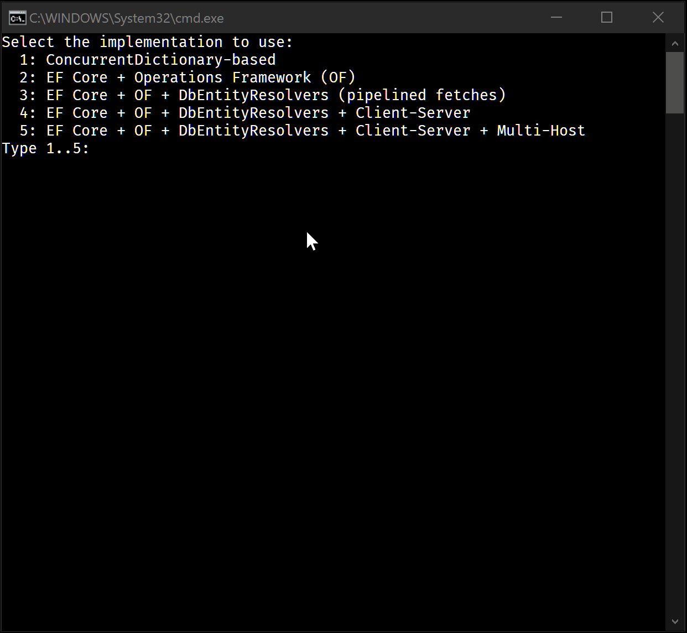

---
# Cart Watcher

```cs
public async Task WatchCartTotal(
    string cartId, CancellationToken cancellationToken)
{
    var cartService = ClientServices.GetRequiredService<ICartService>();
    var computed = await Computed.Capture(
        ct => cartService.GetTotal(cartId, ct), 
        cancellationToken);
    while (true) {
        WriteLine($"  {cartId}: total = {computed.Value}");
        await computed.WhenInvalidated(cancellationToken);
        computed = await computed.Update(false, cancellationToken);
    }
}
```
---
# InMemoryProductService

```cs
public class InMemoryProductService : IProductService
{
    private readonly ConcurrentDictionary<string, Product> _products = new();

    public virtual Task Edit(EditCommand<Product> command, CancellationToken cancellationToken)
    {
        var (productId, product) = command;
        if (product == null)
            _products.Remove(productId, out _);
        else
            _products[productId] = product;
        
        using (Computed.Invalidate()) {
            // Every [ComputeMethod] result you call here 
            // gets invalidated
            TryGet(productId, default).Ignore();
        }
        return Task.CompletedTask;
    }

    public virtual Task<Product?> TryGet(string id, CancellationToken cancellationToken)
        => Task.FromResult(_products.GetValueOrDefault(id));
}
```
---
# InMemoryProductService - the actual one

```cs
public class InMemoryProductService : IProductService
{
    private readonly ConcurrentDictionary<string, Product> _products = new();

    public virtual Task Edit(EditCommand<Product> command, CancellationToken cancellationToken)
    {
        var (productId, product) = command;
        if (Computed.IsInvalidating()) { // !!!
            TryGet(productId, default).Ignore();
            return Task.CompletedTask;
        }

        if (product == null)
            _products.Remove(productId, out _);
        else
            _products[productId] = product;
        return Task.CompletedTask;
    }

    public virtual Task<Product?> TryGet(string id, CancellationToken cancellationToken)
        => Task.FromResult(_products.GetValueOrDefault(id));
}
```
---
# InMemoryCartService

```cs
public class InMemoryCartService : ICartService
{
    private readonly ConcurrentDictionary<string, Cart> _carts = new();
    private readonly IProductService _products;

    public InMemoryCartService(IProductService products) => _products = products;

    public virtual Task Edit(EditCommand<Cart> command, CancellationToken cancellationToken = default)
    {
        var (cartId, cart) = command;
        if (Computed.IsInvalidating()) {
            TryGet(cartId, default).Ignore();
            return Task.CompletedTask;
        }

        if (cart == null)
            _carts.Remove(cartId, out _);
        else
            _carts[cartId] = cart;
        return Task.CompletedTask;
    }

    public virtual Task<Cart?> TryGet(string id, CancellationToken cancellationToken = default)
        => Task.FromResult(_carts.GetValueOrDefault(id));
```
---
# InMemoryCartService.GetTotal

```cs
public virtual async Task<decimal> GetTotal(
    string id, CancellationToken cancellationToken = default)
{
    var cart = await TryGet(id, cancellationToken);
    if (cart == null)
        return 0;
    var total = 0M;
    foreach (var (productId, quantity) in cart.Items) {
        var product = await _products.TryGet(productId, cancellationToken);
        total += (product?.Price ?? 0M) * quantity;
    }
    return total;
}
```
---
# Compute Service Registration

```cs
var services = new ServiceCollection();
services.AddFusion(fusion => {
    fusion.AddComputeService<IProductService, InMemoryProductService>();
    fusion.AddComputeService<ICartService, InMemoryCartService>();
});
var serviceProvider = services.BuildServiceProvider()
```
---
# DbProductService.TryGet

```cs
public virtual async Task<Product?> TryGet(
    string id, CancellationToken cancellationToken = default)
{
    await using var dbContext = CreateDbContext();
    var dbProduct = await dbContext.Products.FindAsync((object) id, cancellationToken);
    if (dbProduct == null)
        return null;
    return new Product() { Id = dbProduct.Id, Price = dbProduct.Price };
}
```

---
# DbProductService.Edit

```cs
public virtual async Task Edit(
    EditCommand<Product> command, CancellationToken cancellationToken = default)
{
    var (productId, product) = command;
    if (Computed.IsInvalidating()) {
        // This block is "replayed" on every host!
        TryGet(productId, default).Ignore();
        return;
    }

    await using var dbContext = await CreateCommandDbContext(cancellationToken);
    var dbProduct = await dbContext.Products.FindAsync((object) productId, cancellationToken);
    if (product == null) {
        if (dbProduct != null)
            dbContext.Remove(dbProduct);
    }
    else {
        if (dbProduct != null)
            dbProduct.Price = product.Price;
        else
            dbContext.Add(new DbProduct { Id = productId, Price = product.Price });
    }
    await dbContext.SaveChangesAsync(cancellationToken);
}
```

---
# Can we replicate `IComputed` on a remote host?

```cs
public class ComputedReplica<T> : IComputed<T> 
{
    ConsistencyState ConsistencyState { get; }
    T Value { get; }
    Exception Error { get; }
    event Action Invalidated;
    
    public ComputedReplica<T>(IComputed<T> source) 
    {
        source.ThrowIfComputing();
        (Value, Error) = (source.Value, source.Error);
        ConsistencyState = source.ConsistencyState;
        source.Invalidated += () => Invalidate(); // !!!
    }

    // ...
}
```
Do the same, but deliver the invalidation event via RPC!

---
# Your Web API call
<!-- _class: highlight -->


---
# Fusion Web API call
<!-- _class: highlight -->


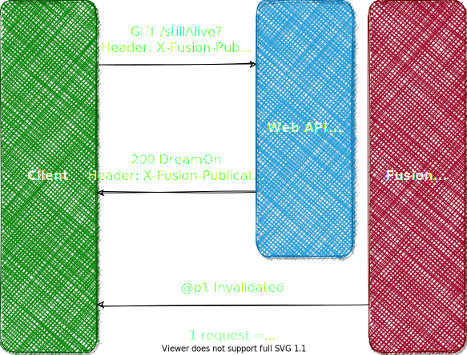

---
# Replica Service - Controller
```cs
[Route("api/[controller]/[action]")]
[ApiController, JsonifyErrors]
public class CartController : ControllerBase, ICartService
{
    private readonly ICartService _cartService;

    public CartController(ICartService cartService) => _cartService = cartService;

    [HttpPost]
    public Task Edit(
      [FromBody] EditCommand<Cart> command, 
      CancellationToken cancellationToken = default)
        => _cartService.Edit(command, cancellationToken);

    [HttpGet, Publish]
    public Task<Cart?> TryGet(string id, CancellationToken cancellationToken = default)
        => _cartService.TryGet(id, cancellationToken);

    [HttpGet, Publish]
    public Task<decimal> GetTotal(string id, CancellationToken cancellationToken = default)
        => _cartService.GetTotal(id, cancellationToken);
}
```

---
# Replica Service - Client
```cs
[BasePath("cart")]
public interface ICartClient
{
    [Post("edit")]
    Task Edit([Body] EditCommand<Cart> command, CancellationToken cancellationToken);
    [Get("tryGet")]
    Task<Cart?> TryGet(string id, CancellationToken cancellationToken);
    [Get("getTotal")]
    Task<decimal> GetTotal(string id, CancellationToken cancellationToken);
}
```

---
# Replica Service Registration
```cs
var services = new ServiceCollection();
services.AddFusion(fusion => {
    fusion.AddRestEaseClient(client => {
        client.ConfigureHttpClientFactory((c, name, options) => {
            var apiBaseUri = new Uri($"{baseUri}api/");
            options.HttpClientActions.Add(httpClient => httpClient.BaseAddress = apiBaseUri);
        });
        client.ConfigureWebSocketChannel((c, options) => { options.BaseUri = baseUri; });
        
        // Actual registration:
        client.AddReplicaService<IProductService, IProductClient>();
        client.AddReplicaService<ICartService, ICartClient>();
    });
});
var serviceProvider = services.BuildServiceProvider();
```

---
# Blazor Component: AppUserBadge

```cs
@inherits LiveComponentBase<bool>
@inject IAppUserService AppUserService

[Parameter]
public string CssClass { get; set; } = "";
[Parameter]
public Color Color { get; set; } = Color.Primary;
[Parameter]
public AppUser User { get; set; } = AppUser.None;

protected override async Task<bool> ComputeState(CancellationToken cancellationToken)
{
    if (User.Id <= 0)
        return false;
    return await AppUserService.IsOnline(User.Id, cancellationToken);
}
```

---
# Blazor Component: AppUserBadge - markup

```html
@{
    var isOnline = State.LastValue;
}

<Badge Color="@Color" Class="@CssClass" Style="@(isOnline ? "" : "opacity: 0.5;")">
    <Blazorise.Icon Name="@(isOnline ? FontAwesomeIcons.User : FontAwesomeIcons.UserClock)" />
    @User.Name
</Badge>
```

---
# Blazor Component: AppUserBadges

```cs
[Parameter]
public IEnumerable<AppUser> Users { get; set; } = Enumerable.Empty<AppUser>();
[Parameter]
public bool UseAndDelimiter { get; set; } = true;

private string GetDelimiter(int index)
    => index switch {
        0 => "",
        1 => UseAndDelimiter ? " and " : ", ",
        _ => ", "
    };
```
Markup:
```html
@foreach(var (user, index) in Users.Select((user, index) => (user, index))) {
    <span>@GetDelimiter(index)</span>
    <AppUserBadge User="@user" />
}
```

---


---
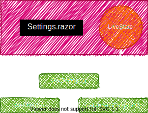

---
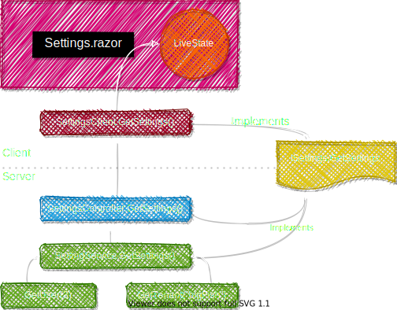

---
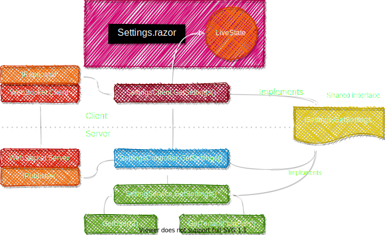

---
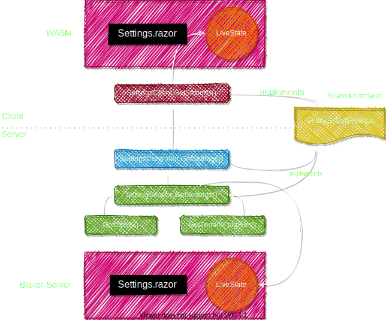

---
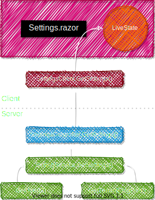

---
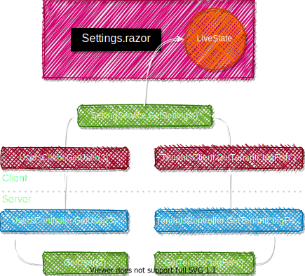

---
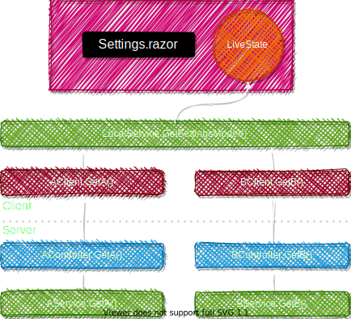

---


---
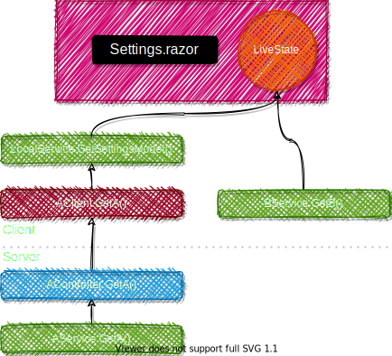

---
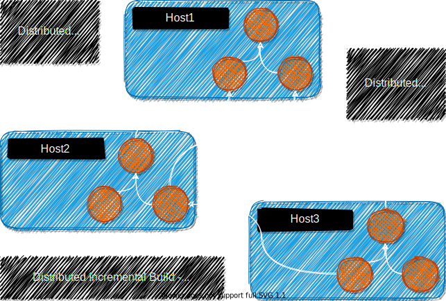

---


---
## `(Local)ComposerService`

> Client-side or server-side? You decide - the code & behavior is +/- identical!

See the power of distributed incremental build in action!
Live demo: https://fusion-samples.servicetitan.com/composition
Source code: [ComposerService](https://github.com/servicetitan/Stl.Fusion.Samples/blob/master/src/Blazor/Server/Services/ComposerService.cs), [LocalComposerService](https://github.com/servicetitan/Stl.Fusion.Samples/blob/master/src/Blazor/UI/Services/LocalComposerService.cs).

```cs
public virtual async Task<ComposedValue> GetComposedValue(
    string parameter, Session session, CancellationToken cancellationToken)
{
    var chatTail = await ChatService.GetChatTail(1, cancellationToken);
    var uptime = await TimeService.GetUptime(TimeSpan.FromSeconds(10), cancellationToken);
    var sum = (double?) null;
    if (double.TryParse(parameter, out var value))
        sum = await SumService.GetSum(new [] { value }, true, cancellationToken);
    var lastChatMessage = chatTail.Messages.SingleOrDefault()?.Text ?? "(no messages)";
    var user = await AuthService.GetUser(session, cancellationToken);
    var activeUserCount = await ChatService.GetActiveUserCount(cancellationToken);
    return new ComposedValue($"{parameter} - server", uptime, sum, lastChatMessage, user, activeUserCount);
}
```

---
# Fusion's caching performance

Most important part of the [performance test](https://github.com/servicetitan/Stl.Fusion/blob/master/tests/Stl.Fusion.Tests/PerformanceTest.cs):
```cs
public virtual async Task<User?> TryGet(long userId)
{
  await Everything(); // LMK if you know what's the role of this call!
  await using var dbContext = DbContextFactory.CreateDbContext(); // Pooled
  var user = await dbContext.Users.FindAsync(new[] {(object) userId});
  return user;
}

// Many readers, 1 (similar) mutator
async Task<long> Reader(string name, int iterationCount)
{
    var rnd = new Random();
    var count = 0L;
    for (; iterationCount > 0; iterationCount--) {
        var userId = (long) rnd.Next(UserCount);
        var user = await users.TryGet(userId);
        if (user!.Id == userId)
            count++;
        extraAction.Invoke(user!); // Optionally serializes the user
    }
    return count;
}
```

---
# Fusion's caching performance
<!-- _class: highlight invert -->

Sqlite EF provider: **16,070x**
<div class="col2" style="margin-top: 0px;">
<pre>
With Stl.Fusion:
  Standard test:
    Speed:      35708.280 K Ops/sec
  Standard test + serialization:
    Speed:      12481.940 K Ops/sec
</pre>
<div class="break"></div>
<pre>
Without Stl.Fusion:
  Standard test:
    Speed:      2.222 K Ops/sec
  Standard test + serialization:
    Speed:      2.179 K Ops/sec
</pre>
</div>

In-memory EF provider: **1,140x**
<div class="col2" style="margin-top: 0px;">
<pre>
With Stl.Fusion:
  Standard test:
    Speed:      30338.256 K Ops/sec
  Standard test + serialization:
    Speed:      11789.282 K Ops/sec
</pre>
<div class="break"></div>
<pre>
Without Stl.Fusion:
  Standard test:
    Speed:      26.553 K Ops/sec
  Standard test + serialization:
    Speed:      26.143 K Ops/sec
</pre>
</div>

And that's just *plain caching*, i.e. no benefits from "incrementally-build-everything"!

---
# Caching Sample & more data points on caching
<!-- _class: highlight invert -->

A very similar code, but exposing the service via Web API. The results: 
- 20,000 → 130,000 RPS = **6.5x throughput**
  With server-side changes only, i.e. the same client.
- 20,000 → 20,000,000 RPS = **1000x throughput!**  
  If you switch to Fusion client (so-called ["Replica Service"](https://github.com/servicetitan/Stl.Fusion.Samples/blob/master/docs/tutorial/Part04.md))

```text
RestEase Client -> ASP.NET Core -> EF Core Service:
  Reads: 20.46K operations/s

RestEase Client -> ASP.NET Core -> Fusion Proxy -> EF Core Service:
  Reads: 127.96K operations/s

Fusion's Replica Client:
  Reads: 20.29M operations/s
```

---
<!-- _class: center invert-->

## How 10x speed boost looks like?

---
<!-- _class: video -->
<iframe src="https://www.youtube.com/embed/05pzUXujMJU?start=186" frameborder="0" allow="accelerometer; autoplay; clipboard-write; encrypted-media; gyroscope; picture-in-picture" allowfullscreen></iframe>

---
<!-- _class: video -->
<iframe src="https://www.youtube.com/embed/lzP0JIzrYmM?start=24" frameborder="0" allow="accelerometer; autoplay; clipboard-write; encrypted-media; gyroscope; picture-in-picture" allowfullscreen></iframe>

---
# Fusion vs Redis, memcached, ...
<!-- _class: highlight -->

⌚ Almost always consistent
🚀 Local = 1000 times faster
❌ No serialization/deserialization
📌 Ref. copy vs deep copy on use
🧱 Incrementally-Build-Everything™
🙀 Supports swapping to ext. caches!


---
# Fusion vs SignalR
<!-- _class: highlight -->

🦌 All SignalR events = 🦄 "X is invalidated".
</br>

Client / UI:
❌ No 📪/unsub. UI models to groups/topics
❌ No update-on-event logic
⌛ Custom update delays (scalability)
👍 Guaranteed eventual consistency!
</br>

Server:
❌ No events, groups/topics
💋 (# of invalidation points) ≪ (# of events)


---
# Fusion vs MobX, KO, ...
<!-- _class: highlight -->

- Decorates APIs (services), not models
- Thread-safe, asynchronous
- Works on the server side
- Explicit consistent / inconsistent states
- No sync. auto-recompute
- Distributed.


---
# Fusion vs Flux, Redux, ...
<!-- _class: highlight invert -->


---
# Fusion vs Flux, Redux, ...
<!-- _class: highlight invert -->

Action, Dispatcher, Store, View.
Usable only in the UI.
Real-time? Sorry, DIY.

And it worth studying because...
Ah, Facebook created it!


---
# The price you pay for Fusion

- **Money:** thanks to [ServiceTitan](servicetitan.com), Fusion is free (MIT license)
- **CPU:** free your CPUs! The torture of making them to run recurring computations again and again must be stopped!
- **RAM:** is where the cost is really paid. Besides that, [remember about GC pauses](https://github.com/servicetitan/Stl.Fusion.Samples/blob/master/docs/tutorial/Part08.md#large-working-sets-and-gc-pauses) and other downsides of local caching. But the upside is so bright + Fusion actually supports external caching via ["swapping" feature](https://github.com/servicetitan/Stl.Fusion.Samples/blob/master/docs/tutorial/Part05.md#caching-options).
- **Learning curve:** is relatively shallow in the beginning, but getting steeper once you start to dig deeper. Though Fusion is definitely not as complex as e.g. TPL with its `ExecutionContext`, `ValueTask<T>`, and other tricky parts.
- **Other risks:** First lines of Fusion code were written ~ 1 year ago. What "other risks" are you talking about?

---
## But...

If you need a real-time UI, Fusion is probably the lesser of many evils you'll have to deal with otherwise. *
</br>
</br>

<footer>(*) Fusion creator's opinion, totally unbiased.</footer>

## &nbsp;
## &nbsp;


---
<!-- _class: center invert-->

## Why real-time matters nowadays?

---

On a serious note: [Real-Time is #1 Feature Your Next Web App Needs](https://alexyakunin.medium.com/features-of-the-future-web-apps-part-1-e32cf4e4e4f4?sk=65dacdbf670ef9b5d961c4c666e223e2)


---
<!-- _class: -->


> It is not the strongest of the species that survives, nor the most intelligent; 
> it is the one most adaptable to change.
> **— Charles Darwin**

</br></br></br></br></br></br></br></br></br></br>

---
<!-- _class: highlight -->


---
<!-- _class: highlight -->


---
<!-- _class: highlight -->


---
<!-- _class: center invert-->

<br><br><br><br>
<h2 style="font-size: 60pt">Thank you!</h1>

<footer style="width: 95%; text-align: right; font-size: 20pt; color: white">
Alex Yakunin</br>
The creator of Fusion, <a href="https://www.servicetitan.com/">ServiceTitan, Inc.</a> CTO</br>
<a href="https://github.com/servicetitan/Stl.Fusion">https://github.com/servicetitan/Stl.Fusion</a></br>
P.S. We need your stars and forks!  </br>
</footer>


