<style>
section tt { font-weight: bold; }
section span.hljs-string { color: #50b050; }
section span.hljs-title { color: #7ff2e1; }
section span.hljs-number { color: #00acc5; }

section.highlight em { color: #aff; font-style: normal; }
section.highlight strong { color: #f44; font-style: normal; font-weight: normal; }

section.center {
  text-align: center;
}

section.video {
  padding: 0px;
  margin: 0px;
}
section.video iframe {
  width: 100%;
  height: 100%;
}

div.col2 {
  margin-top: 35px;
  column-count: 2;
}
div.col2 p:first-child,
div.col2 h1:first-child,
div.col2 h2:first-child,
div.col2 h3:first-child,
div.col2 ul:first-child,
div.col2 ul li:first-child,
div.col2 ul li p:first-child {
  margin-top: 0 !important;
}
div.col2 .break {
  break-before: column;
  margin-top: 0;
}
</style>


<p style="text-align: right">
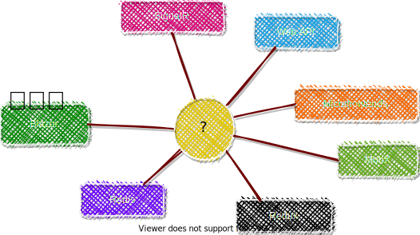
</p>

---

## Is real-time UI </br>really hard to code</br> or do I suck?

---
<!-- _class: invert center -->

### </br>Twitter can do it,</br>so you can do it too!

---
<!-- _class: highlight center invert -->

# But first, let's talk about</br>*incremental builds*

---
<!-- _class: highlight center -->

<footer><h2>Initial state</h2></footer>

---
<!-- _class: highlight center -->

<footer><h2>Edit "Services.cs"</h2></footer>

---
<!-- _class: highlight center -->

<footer><h2>Artifacts to rebuild</h2></footer>

---
<!-- _class: highlight center -->

<footer><h2>Build "App.exe"</h2></footer>

---
<!-- _class: highlight center -->


# How the hell this is relevant to real-time?
Kids, look what happens when you code 24/7!

---
# Imagine your app is a composition of functions...

```cs
// UI
string RenderAppUI() { 
  // ...
  uiBuilder.Append(RenderUserInfo(userId));
  uiBuilder.Append(RenderCartTotal(cartId));
  // ...
  return uiBuilder.ToString();
} 

string RenderUserInfo(string userId) {
  var user = UserServiceClient.GetUser(userId);
  return $"<div class="user-info">user.Name</div>";
}

string RenderCartTotal(string cartId) {
  var cartTotal = CartServiceClient.GetCartTotal(cartId);
  return $"<div class="cart-total">Total: {cartTotal}$</div>";
}
```

---
<!-- _class: highlight -->
# Why don't we write everything this way?

We'll hit every possible threshold:
1. Recompute everything → **saturate CPU**
2. Chatty client-server RPC → **saturate NIC**

**Valid points. It won't work. Can we go now?**


---
# No! Let's write a function!

```cs
decimal GetCartTotal(string cartId) 
{
  var cartTotal = 0M;
  var cart = Carts.Get(string userId); // Carts is ICartService
  var specialOffers = SpecialOffers.GetActive(); // etc.
  foreach (var item in cart.Items) {
    var product = Products.Get(item.ProductId);
    var productPrice = Prices.Get(item.ProductId);
    cartTotal += item.Quantity * productPrice;
    cartTotal -= specialOffers
      .Select(offer => offer.GetDiscount(product, price, item.Quantity))
      .Max();
  }
  return cartTotal;
}
```
<footer>
(*) We ignore such minor issues as the absence of async code &ndash; for now.
</footer>

---
<!-- _class: highlight center -->


---
<!-- _class: highlight center -->


---
<!-- _class: highlight center -->


---
<!-- _class: highlight center -->


# </br></br></br></br></br></br></br></br><b>THEY CONVERGED!</b>

---
<!-- _class: highlight center -->


---
<!-- _class: highlight invert-->

# A new Incremental Builder build you must!

1. Recompute everything → saturate CPU
   **May the Cache be with you!**
2. Chatty client-server RPC → saturate NIC
   **And the Client-Side Cache too!**

---
<!-- _class: highlight invert -->

# To Cache

means to store and reuse the results of computations executed in past.

**Do we always cache everything?**

---
<!-- _class: highlight center -->

<header>
<h1>Caching as a Higher Order Function</h1>
</header>

---
<!-- _class: highlight center -->

<header>
<h1>Caching as a Higher Order Function</h1>
</header>

---
# Caching as a Higher Order Function

```cs
Func<TIn, TOut> ToCaching<TIn, TOut>(Func<TIn, TOut> fn)
  => input => {
    var key = Cache.CreateKey(fn, input);
    if (Cache.TryGet(key, out var output)) return output;
    lock (Cache.Lock(key)) { // Double-check locking
      if (Cache.TryGet(key, out output)) return output;

      output = fn(input);

      Cache[key] = output;
      return output;
    }
  }

var cachingGetCartTotal = ToCaching(Carts.GetCartTotal);
var cartTotal = cachingGetCartTotal.Invoke("cart1");
```

---

# A Tiny Problem

To make it work, <tt>fn</tt> must be a **pure function**.

⇒ You saw a Vaporware Version™ of <tt>ToCaching</tt>.

---
# Solutions*

<div class="col2">
<p><b>Plan 😈:</b> Purify every function!</p>
<p></p>

<div class="break"></div>
<p><b>Plan 🦄:</b> Add dependency tracking + cascading invalidation</p>
<p></p>
</div>

<footer>
(*) I'm absolutely sure there are other solutions. But there is no more space on this slide, so...
</footer>

---
## Plan 🦄: Add Dependency Tracking + Cascading Invalidation

```cs
Func<TIn, TOut> ToAwesome<TIn, TOut>(Func<TIn, TOut> fn)
  => input => {
    var key = Cache.CreateKey(fn, input);
    if (Cache.TryGet(key, out var computed)) return computed.Use();
    lock (Cache.Lock(key)) { // Double-check locking
      if (Cache.TryGet(key, out computed)) return  computed.Use();

      computed = new Computed(fn, input, key);
      using (Computed.ChangeCurrent(computed))
        computed.Value = fn(input);

      Cache[key] = computed;
      return computed.Use();
    }
  }
```

---
# Dependency Capture

```cs
static TOut Use()
{
  if (Computed.IsInvalidating) { // Will explain this later
    Invalidate(); 
    return default;
  }
  // Use = register as a dependency + "unwrap" the Value
  Computed.Current.AddDependency(this);
  return Value;
}
```

---
## Invalidation = Marking `Computed` as Inconsistent / Dirty

```cs
public void Invalidate() 
{
  if (ConsistencyState.Invalidated == Interlocked.Exchange(
      ref _state, ConsistencyState.Invalidated))
    return;
  Cache.Remove(Key);
  foreach (var usedBy in UsedBySet) // Dependants
    usedBy.Invalidate();
  OnInvalidated();
}

public static Disposable Computed.Invalidate()
{
  var oldIsInvalidating = Computed.IsInvalidating;
  Computed.IsInvalidating = true;
  return Disposable.New(() => 
    Computed.IsInvalidating = oldIsInvalidating);
}
```

---
## Plan 🦄: Example

```cs
// IProductService code
void Update(Product product) 
{
  var oldProduct = ProductRepo.Get(product);
  ProductRepo.Update(product);

  // Invalidation logic
  using (Computed.Invalidate()) {
    Get(product.Id);
    Count();
    if (oldProduct.IsFeatured || product.IsFeatured)
      GetFeatured();
  }
}
```

---
<!-- _class: highlight center -->

<footer><h2>Initial state</h2></footer>

---
<!-- _class: highlight center -->

<footer><h2>Invalidate Products.Get("carrot")</h2></footer>

---
<!-- _class: highlight center -->

<footer><h2>Invalidate Prices.Get("apple")</h2></footer>

---
<!-- _class: highlight center -->

<footer><h2>Call SpecialOffers.GetActive()</h2></footer>

---

# ⚒️ Incrementally-Build-Everything Decorator

"So, tell me, my little one-eyed one, on what poor, pitiful, defenseless planet has my monstrosity been unleashed?"

&ndash; [Dr. Jumba Jookiba](https://disney.fandom.com/wiki/Jumba_Jookiba), #1 scientist in my list

---
<!-- _class: highlight invert-->

# Superpowers acquired:

- *Everything is cached*
  and *(re)computed incrementally*
- Dependencies are *captured automatically*
- So we *invalidate just what's produced externally!*
- It's a *transparent abstraction* that doesn't change functions' signatures, code, and even their output!<sup>*</sup>

<footer>(*) Except different timings & tiny periods of inconsistency.</footer>

---
<!-- _class: highlight invert -->

# Do we really need delegates to decorate them?

We don't. 

All modern .NET apps rely on Dependency Injection.

Making DI container to provide a proxy implementing such decorators is a 🍰

So it can be <span style="opacity: 0.05">absolutely transparent!</span>

---
<!-- _class: highlight invert -->

# Can I use it now?

Not quite:
- No async/await, thread-safety
- We need GC-friendly cache and `UsedBySet`
- No actual impl. of `Computed`
- Etc.

> Boring technical problems!
> &ndash; Elon Musk*

Let me show 100+ more slides first!

<footer>(*) Pretty sure he said this at least once

---
<!-- _class: center invert highlight-->

<h1 style="color: white">
</br>
</br>
</br>
</br>
What about <em>eventual consistency</em>?</br>
What about <em>React</em> and <em>Blazor</em>?</br>
</br>
We need to go deeper!
</h1>

---
<!-- _class: invert center -->

<h3></br>
What is worse than</br>
eventual consistency?</br>
Permanent inconsistency.
</h3>

---
<!-- _class: center -->

<h3>
</br>
Two eventually consistent systems were left at your doorstep.</br>
Which one you should marry?
</h3>

<div class="col2">
<h2>&nbsp;&nbsp;&nbsp;&nbsp;&nbsp;&nbsp;&nbsp;&nbsp;&nbsp;&nbsp;&nbsp;&nbsp;&nbsp;&nbsp;&nbsp;&nbsp;#1</h1>
<div class="break"></div>
<h2>#2&nbsp;&nbsp;&nbsp;&nbsp;&nbsp;&nbsp;</h1>
<br/>
</div>

---
<!-- _class:  -->


---
<!-- _class:  -->


---
<!-- _class:  -->


---
<!-- _class:  -->


---
<!-- _class: center invert -->

## How this is relevant to real-time, again?

---
<!-- _class: highlight invert -->

# Real-time updates require you to...

- Know when a result of a function changes
  **Invalidate all the things!**
- Recompute new results quickly
  **Incrementally build all the things!**
- Send them over the network
  **Blazorise and AspNetCorise all the things?**
- Ideally, as a compact diff to the prev. state
  **Diff can be computed in `O(diffSize)` for immutable types (<a href="https://medium.com/swlh/fusion-current-state-and-upcoming-features-88bc4201594b?source=friends_link&sk=375290c4538167fe99419a744f3d42d5">details</a>).</span>**


---
<!-- _class: highlight invert -->
*"There are only two hard things in Computer Science: **cache invalidation** and **naming things**."*
&ndash; Phil Karlton

</br>
See, we've made a meaningful progress with an easy one!

<footer>
A  collection of other "two things in computer science" memes: <a href="https://martinfowler.com/bliki/TwoHardThings.html">https://martinfowler.com/bliki/TwoHardThings.html</a>
</footer>

---
<!-- _class: highlight center -->

<header><h1>WHAT ABOUT...</h1></header>

---

# Blazor is:

- .NET running in your browser on top of WASM!
- 100% compatible with .NET 5: 
  - `Expression.Compile(...)`, Reflection, `Task<T>`, etc. &ndash; it just works!
  - Nearly all of your managed code will run on Blazor too.
- (Blazor Components, React Components) ≍ 
  (🦄,🦌) &ndash; same, but better! 
  **Oh, this is so Microsoftey!**

<footer>
Blazor fans, see the image of the Blazor God!</br>
Coincidentally, <a href="https://twitter.com/StevenSanderson">Mr. Sanderson</a> is also the creator of <a href="https://knockoutjs.com/">Knockout.js.</a>
</footer>

---


---
<!-- _class: highlight invert -->

# Blazor &ndash; cons:

- 1🧵 for now &ndash; but **JS developers live with this 💩 for 25 years, SO WE CAN!**
- No JIT / AOT yet, MSIL is interpreted. 
  **.NET 6, don't disappoint us! 
  10🧵 x 20x AOT ≃ 200x🚀**
- Even a small project downloads 2…4 MB of .NET .dlls (gzipped!) - and that's after linking with tree shaking.
  **Cmon, it's 21 century &ndash; size doesn't matter! At least online, right?**

---
## React Component - UI markup example

```js
class App extends React.Component {
  render = () => 
    <div class="main">
      <Welcome name="World" />
      <Clock />
    </div>
}
```

See it on CodePen: https://codepen.io/alexyakunin/pen/xxRzgaK?editors=1111

---
## React Component - (de?)compiled version

```js
class App extends React.Component {
  constructor(...args) {
    super(...args);
    _defineProperty(this, "render", () =>
        // render() generates Virtual DOM
        React.createElement("div", { class: "main" },
          React.createElement(Welcome, { name: "World" }),
          React.createElement(Clock, null))
          );
  }
}
```

---
## Blazor Component - UI markup example

```html
<div class="main">
    <Welcome Name="World"/>
    <Clock />
</div>
```

See it on BlazorREPL: https://blazorrepl.com/repl/wluHuIOv061KS9Vt31

---
## Blazor Component - decompiled version

```cs
  public class Index : ComponentBase
  {
    protected override void BuildRenderTree(RenderTreeBuilder __builder)
    {
      // BuildRenderTree(...) generates Virtual DOM too,
      // just relying on builder
      __builder.OpenElement(0, "div"); // Notice: OpenElement
      __builder.AddAttribute(1, "class", "main");
      __builder.OpenComponent<Welcome>(2); // Notice: OpenComponent
      __builder.AddAttribute(3, "Name", "World");
      __builder.CloseComponent();
      __builder.AddMarkupContent(4, "\r\n    ");
      __builder.OpenComponent<Clock>(5);
      __builder.CloseComponent();
      __builder.CloseElement();
    }
  }
```
---


---


---
<!-- _class: highlight center -->


<footer>One more argument to use Blazor, btw.</footer>

---
<!-- _class: highlight center -->


---
<!-- _class: highlight center -->

<div style="text-align: center">
<h2 style="margin: 0px">
  <h2>React and Blazor are "make"-like incremental builders for your UI</h2>
</h2>
<div style="margin: 0px">
  Just specialized ones &ndash; designed to incrementally update DOM</br>
  (actually, any UI control tree) after any component's render() that</br>
  actually just defines the new desirable UI state.
</div>

---
<!-- _class: highlight center -->


---
<!-- _class: invert-->


---
<!-- _class: highlight center -->

<div style="text-align: center">
</br>
&nbsp;&nbsp;
</div>

---
<!-- _class: center invert -->
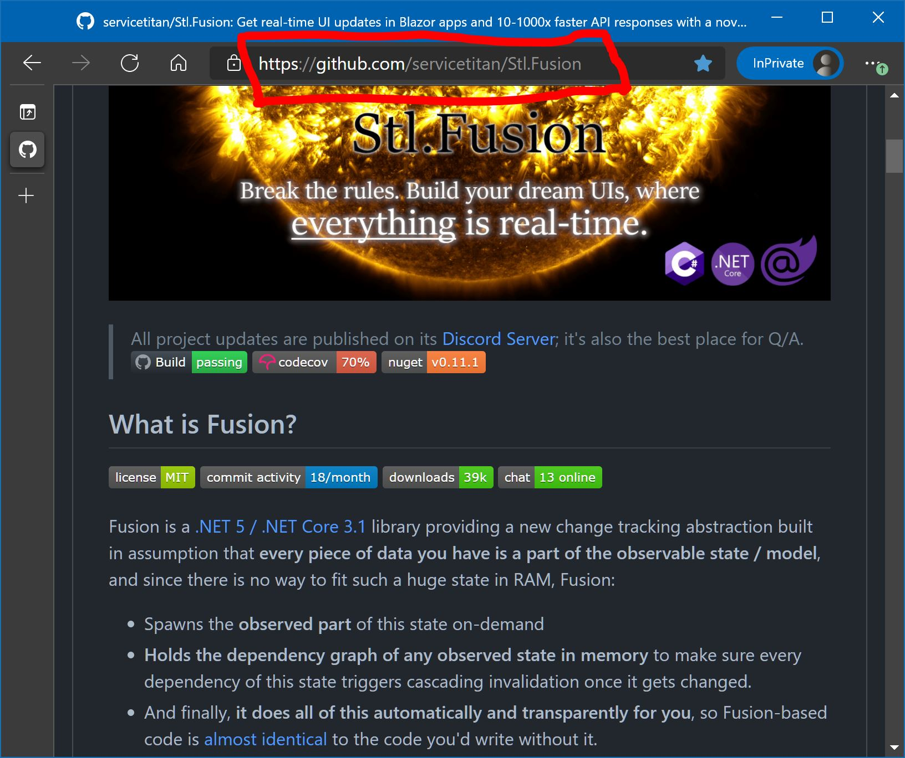

---
<!-- _class: center -->


<div style="font-size: 100px; color: #eee; text-shadow: 2px 2px #000;">
  <a href="http://fusion-samples.servicetitan.com/" 
     style="color: #eee">DEMO</a>
</div>

<footer style="text-align: left">
  <span style="background: #9F0; color: #000; padding: 3pt;">
  Live samples:&nbsp;</br>
  &nbsp;&ndash; <a href="http://fusion-samples.servicetitan.com/">https://fusion-samples.servicetitan.com</a>&nbsp;&nbsp;</br>
  &nbsp;&ndash; <a href="http://boardgames.alexyakunin.com/">https://boardgames.alexyakunin.com</a>&nbsp;
  </span>
</footer>

---
## Remember Caching Decorator with Dependency Tracking?

```cs
Func<TIn, TOut> ToAwesome<TIn, TOut>(Func<TIn, TOut> fn)
  => input => {
    var key = Cache.CreateKey(fn, input);
    if (Cache.TryGet(key, out var computed)) return computed.Use();
    lock (Cache.Lock(key)) { // Double-check locking
      if (Cache.TryGet(key, out computed)) return  computed.Use();

      computed = new Computed(fn, input, key);
      using (Computed.ChangeCurrent(computed))
        computed.Value = fn(input);

      Cache[key] = computed;
      return computed.Value;
    }
  }
```
---

## Fusion's version of this decorator is:

- GC-friendly
- Async, thread-safe
- Uses AOP-style decoration
- Relies on immutable<sup>*</sup> `IComputed<T>`
- Distributed
- Supports multi-host invalidation / scales horizontally
- And much more!

<footer>(*) Almost immutable</footer>

---
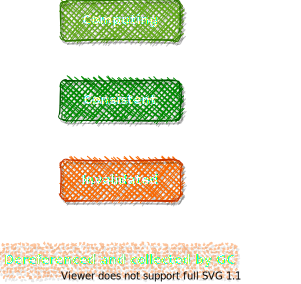
# Fusion's `IComputed<T>`:

A bit simplified version of actual `IComputed<T>`:

```cs
interface IComputed<T> {
  ConsistencyState ConsistencyState { get; } 
  T Value { get; }
  Exception Error { get; }
  
  event Action Invalidated; // Event, triggered just once on invalidation
  Task WhenInvalidated(); // Alternative way to await for invalidation
  void Invalidate();
  Task<IComputed<T>> Update(); // Notice it returns a new instance!
}
```

---


---


---
# TodoApp: `ITodoService` API

**Note:** `CancellationToken` argument is removed here & further to keep things simple.

```cs
public interface ITodoService
{
    // Commands
    [CommandHandler]
    Task<Todo> AddOrUpdate(AddOrUpdateTodoCommand command);
    [CommandHandler]
    Task Remove(RemoveTodoCommand command);

    // Queries
    [ComputeMethod]
    Task<Todo?> TryGet(Session session, string id);
    [ComputeMethod]
    Task<Todo[]> List(Session session, PageRef<string> pageRef);
    [ComputeMethod]
    Task<TodoSummary> GetSummary(Session session);
}
```

---
# TodoApp: API models / DTOs

```cs
public record Todo(string Id, string Title, bool IsDone = false)
{
    public Todo() : this("", "") { }
}

public record TodoSummary(int Count, int DoneCount)
{
    public TodoSummary() : this(0, 0) { }
}

// Commands

public record AddOrUpdateTodoCommand(Session Session, Todo Item) : ISessionCommand<Todo>
{
    public AddOrUpdateTodoCommand() : this(Session.Null, default(Todo)!) { }
}

public record RemoveTodoCommand(Session Session, string Id) : ISessionCommand<Unit>
{
    public RemoveTodoCommand() : this(Session.Null, "") { }
}
```

---
<div class="col2">

<div class="break">

</div>

---
# SimpleTodoService: query methods

```cs
public class SimpleTodoService : ITodoService
{
    private ImmutableList<Todo> _store = ImmutableList<Todo>.Empty;

    [ComputeMethod]
    public virtual async Task<Todo?> TryGet(Session session, string id)
        => _store.SingleOrDefault(i => i.Id == id);

    [ComputeMethod]
    public virtual async Task<TodoSummary> GetSummary(Session session)
    {
        await PseudoGetAllItems(session);
        var count = _store.Count();
        var doneCount = _store.Count(i => i.IsDone);
        return new TodoSummary(count, doneCount);
    }

    // Pseudo queries

    [ComputeMethod]
    protected virtual Task<Unit> PseudoGetAllItems(Session session)
        => TaskEx.UnitTask;
}
```

---
# SimpleTodoService: command handler

```cs
[CommandHandler]
public virtual async Task<Todo> AddOrUpdate(AddOrUpdateTodoCommand command)
{
    // I'll explain further why this line is needed
    if (Computed.IsInvalidating()) return null!;

    var (session, todo) = command;
    if (string.IsNullOrEmpty(todo.Id))
        todo = todo with { Id = Ulid.NewUlid().ToString() };
    _store = _store.RemoveAll(i => i.Id == todo.Id).Add(todo);

    using var _ = Computed.Invalidate();
    TryGet(session, todo.Id).Ignore();
    PseudoGetAllItems(session).Ignore();
    return todo;
}
```

---
# SimpleTodoService: registration

```cs
var services = new ServiceCollection();
var fusion = services.AddFusion();

// ~ Like service.AddSingleton<ITodoService, SimpleTodoService>()
fusion.AddComputeService<ITodoService, SimpleTodoService>();

// ...
var serviceProvider = services.BuildServiceProvider()
```

---
<video muted class="bg" onclick="this.paused ? this.play() : this.pause(); this.blur()" onpause="">
  <source src="./img/TodoApp-SimpleTodoService.webm" type="video/webm" />
</video>

<footer style="position: absolute; z-index: 1000">
  <h2 style="
    position: relative; left: -1em; top: 1.2em;
    background: #9F0; color: #000; padding: 3pt;">
    <span style="background: #000; color: #9F0;">&nbsp;Click to play/pause&nbsp;</span>
    TodoApp, v1: SimpleTodoService running on the client&nbsp;
  </h2>
</footer>

---
# TodoSummaryBadge.razor

Auto-updating "done / total". There is no other code related to this!

```cs
@inherits ComputedStateComponent<TodoSummary>
@inject ITodoService Todos
@inject Session Session

@{
    var summary = State.ValueOrDefault ?? new();
}

@if (summary != null) {
    <Badge Color="Color.Success"><b>@summary.DoneCount</b> done</Badge>
    <Badge Color="Color.Primary"><b>@summary.Count</b> total</Badge>
}

@code {
    protected override Task<TodoSummary> ComputeState()
        => Todos.GetSummary(Session);
}
```

---
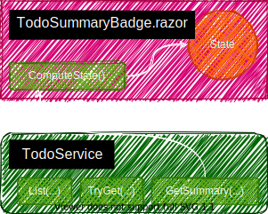

---
# TodoPage.razor (p. 1)

```cs
@page "/todo"
@inherits ComputedStateComponent<Todo[]>
@inject ITodoService Todos
@inject Session Session
@inject CommandRunner CommandRunner
@inject ILogger<TodoPage> Log

@{
    Log.LogInformation(
        "Rendering, State.Computed.Version = {Version}", 
        State.Computed.Version);

    var error = State.Error;
    var todos = State.ValueOrDefault ?? Array.Empty<Todo>();
}
```

---
# TodoPage.razor (p. 2)

```xml
<h1>Todo List</h1>
<StateOfStateBadge State="@State" />
<Text>
    Updated: <MomentsAgoBadge Value="LastStateUpdateTime" />
</Text>

<AuthorizeView>
    <NotAuthorized><SignInDropdown Why="to use this page" /></NotAuthorized>
    <Authorized>
        <WhenException Exception="error" />
        <WhenCommandError Exception="CommandRunner.Error" />
        
        <TodoSummaryBadge/>
        @foreach (var todo in todos) {
            <TodoItemView @key="@todo.Id" Value="@todo" CommandRunner="@CommandRunner"/>
        }
        @if (HasMore) {
            <Button Clicked="_ => LoadMore()">Load @PageSize more</Button>
        }
        <Form @onsubmit="_ => Create()">
            <Button Type="@ButtonType.Submit"><Icon Name="@FontAwesomeIcons.PlusSquare"/></Button>
            <input @bind="NewTodoTitle" @bind:event="onchange" />
        </Form>
    </Authorized>
</AuthorizeView>
```

---
# TodoPage.razor (p. 3)

```cs
protected override async Task<Todo[]> ComputeState()
{
    var items = await Todos.List(Session, PageSize + 1);
    HasMore = items.Length > PageSize;
    if (HasMore)
        items = items[0..PageSize];
    LastStateUpdateTime = DateTime.UtcNow;
    return items;
}

private void LoadMore()
{
    PageSize *= 2;
    State.Recompute();
}

private void Create()
{
    var todo = new Todo("", NewTodoTitle);
    NewTodoTitle = "";
    CommandRunner.Call(new AddOrUpdateTodoCommand(Session, todo));
}
```

---
# CommandRunner.Call

Invokes CommandR-based command execution pipeline for the specified command
and exposes an error (if any) via its property rather than throwing it.

```cs
public async Task<TResult> Call<TResult>(ICommand<TResult> command)
{
    Error = null;
    try {
        return await Commander.Call(command);
    }
    catch (Exception e) {
        Error = e;
        return default!;
    }
    finally {
        if (Component is StatefulComponentBase { UntypedState: IComputedState state })
            // This call just "speeds up" the update that follows user action 
            // by decreasing IComputedState's update delay to zero.
            state.ApplyUserCausedUpdate(); 
    }
}
```

---
# MomentsAgoBadge.razor

Another auto-updating component.

```cs
@inherits ComputedStateComponent<string>
@inject IFusionTime _fusionTime

@State.Value

@code {
    [Parameter] public DateTime? Value { get; set; }
    [Parameter] public string None { get; set; } = "n/a";

    protected override Task<string> ComputeState()
        => Value.HasValue 
            ? _fusionTime.GetMomentsAgo(Value.Value) 
            : Task.FromResult(None);
}
```

---
# IFusionTime

Fusion-style time service invalidating its outputs after certain time period.

```cs
public interface IFusionTime
{
    [ComputeMethod]
    Task<DateTime> GetUtcNow();
    [ComputeMethod]
    Task<DateTime> GetUtcNow(TimeSpan updatePeriod);
    [ComputeMethod]
    Task<string> GetMomentsAgo(DateTime time);
}
```

---


---
<!-- _class: -->

# Can one Fusion service call another Fusion service?

IT MUST, NOT CAN! 
Pros: **No need to invalidate anything!**
Cons: **None.**

---
<!-- _class: -->

# Built-in Compute Services:

- `IFusionTime`
- `IKeyValueStore` 
  - `DbKeyValueStore` (EF-backed)
  - `InMemoryKeyValueStore`
- `ISandboxedKeyValueStore`
- `IAuthService` (EF-backed, in-memory)

---
# IKeyValueStore

```cs
public interface IKeyValueStore
{
    [CommandHandler] Task Set(SetCommand command);
    [CommandHandler] Task SetMany(SetManyCommand command);
    [CommandHandler] Task Remove(RemoveCommand command);
    [CommandHandler] Task RemoveMany(RemoveManyCommand command);

    [ComputeMethod] Task<string?> TryGet(string key);
    [ComputeMethod] Task<int> Count(string prefix);
    [ComputeMethod] Task<string[]> ListKeySuffixes(
        string prefix,
        PageRef<string> pageRef,
        SortDirection sortDirection = SortDirection.Ascending);
}
```

---
# ISandboxedKeyValueStore

Same as `IKeyValueStore`, just requiring `Session` everywhere to
constraint keys to ~ "user folder".

```cs
public interface ISandboxedKeyValueStore
{
    [CommandHandler] Task Set(SandboxedSetCommand command);
    [CommandHandler] Task SetMany(SandboxedSetManyCommand command);
    [CommandHandler] Task Remove(SandboxedRemoveCommand command);
    [CommandHandler] Task RemoveMany(SandboxedRemoveManyCommand command);

    [ComputeMethod] Task<string?> TryGet(Session session, string key);
    [ComputeMethod] Task<int> Count(Session session, string prefix);
    [ComputeMethod] Task<string[]> ListKeySuffixes(
        Session session,
        string prefix,
        PageRef<string> pageRef,
        SortDirection sortDirection = SortDirection.Ascending);
}
```

---
# TodoService: command handler method

```cs
public class TodoService : ITodoService
{
    private readonly ISandboxedKeyValueStore _store;
    private readonly IAuthService _authService;

    public virtual async Task Remove(RemoveTodoCommand command)
    {
        if (Computed.IsInvalidating()) return;

        var (session, id) = command;
        var user = await _authService.GetUser(session);
        user.MustBeAuthenticated();

        var key = GetTodoKey(user, id);
        var doneKey = GetDoneKey(user, id);
        await _store.Remove(session, key);
        await _store.Remove(session, doneKey);
    }

    private string GetTodoKey(User user, string id) => $"{GetTodoKeyPrefix(user)}/{id}";
    private string GetDoneKey(User user, string id) => $"{GetDoneKeyPrefix(user)}/{id}";
    private string GetTodoKeyPrefix(User user) => $"@user/{user.Id}/todo/items";
    private string GetDoneKeyPrefix(User user) => $"@user/{user.Id}/todo/done";

    // ...

```

---
# TodoService: query method

```cs
public virtual async Task<TodoSummary> GetSummary(Session session)
{
    var user = await _authService.GetUser(session);
    user.MustBeAuthenticated();

    var count = await _store.Count(session, GetTodoKeyPrefix(user));
    var doneCount = await _store.Count(session, GetDoneKeyPrefix(user));
    return new TodoSummary(count, doneCount);
}
```

---
<video muted class="bg" onclick="this.paused ? this.play() : this.pause(); this.blur()" onpause="">
  <source src="./img/TodoApp-ClientTodoService.webm" type="video/webm" />
</video>

<footer style="position: absolute; z-index: 1000">
  <h2 style="
    position: relative; left: -1em; top: 1.2em;
    background: #9F0; color: #000; padding: 3pt;">
    <span style="background: #000; color: #9F0;">&nbsp;Click to play/pause&nbsp;</span>
    TodoApp, v2: TodoService + IKeyValueStore running on the client&nbsp;
  </h2>
</footer>

---


---
# Can we replicate `IComputed` on a remote host?

```cs
public class ComputedReplica<T> : IComputed<T> 
{
    ConsistencyState ConsistencyState { get; }
    T Value { get; }
    Exception Error { get; }
    event Action Invalidated;
    
    public ComputedReplica<T>(IComputed<T> source) 
    {
        (Value, Error) = (source.Value, source.Error);
        ConsistencyState = source.ConsistencyState;
        source.Invalidated += () => Invalidate();
    }

    // ...
}
```
Do the same, but deliver the invalidation event via RPC!

---
<!-- _class: highlight -->

# Your Web API call


---
<!-- _class: highlight -->

# Fusion Web API call
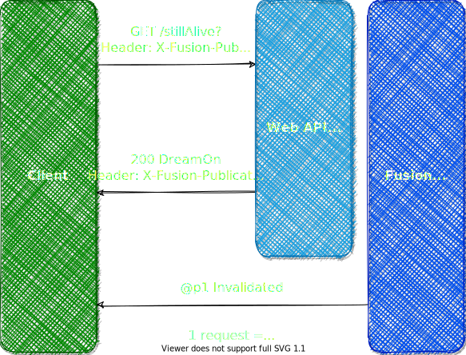

---
<!-- _class: highlight invert-->

# A new Incremental Builder build you must!

1. Recompute everything → saturate CPU
   **May the Cache be with you!**
2. Chatty client-server RPC → saturate NIC
   **And the Client-Side Cache too!**

---
<!-- _class: highlight -->

# Fusion Replica Service
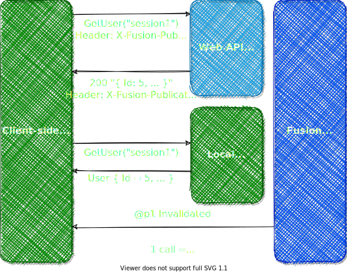

---
# Replica Service: controller
```cs
[Route("api/[controller]/[action]")]
[ApiController, JsonifyErrors]
public class TodoController : ControllerBase, ITodoService
{
    private readonly ITodoService _todos;
    private readonly ISessionResolver _sessionResolver;
    
    [HttpPost]
    public Task<Todo> AddOrUpdate([FromBody] AddOrUpdateTodoCommand command)
    {
        command.UseDefaultSession(_sessionResolver);
        return _todos.AddOrUpdate(command);
    }

    [HttpGet, Publish]
    public Task<Todo?> TryGet(Session? session, string id)
    {
        session ??= _sessionResolver.Session;
        return _todos.TryGet(session, id);
    }

    // ...
}
```

---
# Replica Service: client definition

It's not the actual type you consume - the actual runtime-generated replica service (AKA Fusion client) implements the same `ITodoService`. `ITodoClient` type just maps its endpoints to the web API relying on [RestEase](https://github.com/canton7/RestEase) under the hood.

```cs
[BasePath("todo")]
public interface ITodoClient 
{
    [Post(nameof(AddOrUpdate))]
    Task<Todo> AddOrUpdate([Body] AddOrUpdateTodoCommand command);
    [Post(nameof(Remove))]
    Task Remove([Body] RemoveTodoCommand command);

    [Get(nameof(TryGet))]
    Task<Todo?> TryGet(Session session, string id);
    [Get(nameof(List))]
    Task<Todo[]> List(Session session, PageRef<string> pageRef);
    [Get(nameof(GetSummary))]
    Task<TodoSummary> GetSummary(Session session);
}
```

---
# Replica Service: registration
```cs
var services = new ServiceCollection();
var fusion = services.AddFusion();

// Adding & configuring services required for Replica Services to operate
var baseUri = new Uri(builder.HostEnvironment.BaseAddress);
var apiBaseUri = new Uri($"{baseUri}api/");
var fusionClient = fusion.AddRestEaseClient((_, o) => {
    o.BaseUri = baseUri;
    o.MessageLogLevel = LogLevel.Information;
});
fusionClient.ConfigureHttpClientFactory((c, name, o) => {
    var isFusionClient = (name ?? "").StartsWith("Stl.Fusion");
    var clientBaseUri = isFusionClient ? baseUri : apiBaseUri;
    o.HttpClientActions.Add(client => client.BaseAddress = clientBaseUri);
});

// Adding actual replica service
fusionClient.AddReplicaService<ITodoService, ITodoClient>();
```

---


---


---


---


---


---
<video muted class="bg" onclick="this.paused ? this.play() : this.pause(); this.blur()" onpause="">
  <source src="./img/TodoApp-ServerTodoService.webm" type="video/webm" />
</video>

<footer style="position: absolute; z-index: 1000">
  <h2 style="
    position: relative; left: -1em; top: 1.2em;
    background: #9F0; color: #000; padding: 3pt;">
    <span style="background: #000; color: #9F0;">&nbsp;Click to play/pause&nbsp;</span>
    TodoApp, v3: Server-side TodoService, Blazor Server + WASM, debugging,  console client&nbsp;
  </h2>
</footer>

  </h2>
</footer>

---


---


---


---
<video muted class="bg" onclick="this.paused ? this.play() : this.pause(); this.blur()" onpause="">
  <source src="./img/TodoApp-Multihost.webm" type="video/webm" />
</video>

<footer style="position: absolute; z-index: 1000">
  <h2 style="
    position: relative; left: -1em; top: 1.2em;
    background: #9F0; color: #000; padding: 3pt;">
    <span style="background: #000; color: #9F0;">&nbsp;Click to play/pause&nbsp;</span>
    TodoApp, v4: Multiple hosts&nbsp;
  </h2>
</footer>

---
# HelloCart: DbProductService.Edit (command)

```cs
public virtual async Task Edit(EditCommand<Product> command)
{
    var (productId, product) = command;
    if (Computed.IsInvalidating()) {
        // This block is "replayed" on every host!
        TryGet(productId).Ignore();
        return;
    }

    await using var dbContext = await CreateCommandDbContext();
    var dbProduct = await dbContext.Products.FindAsync((object) productId);
    if (product == null) {
        if (dbProduct != null)
            dbContext.Remove(dbProduct);
    }
    else {
        if (dbProduct != null)
            dbProduct.Price = product.Price;
        else
            dbContext.Add(new DbProduct { Id = productId, Price = product.Price });
    }
    await dbContext.SaveChangesAsync();
}
```

---
# HelloCart: DbProductService.TryGet (query)

```cs
public virtual async Task<Product?> TryGet(string id)
{
    await using var dbContext = CreateDbContext();
    var dbProduct = await dbContext.Products.FindAsync((object) id);
    if (dbProduct == null)
        return null;
    return new Product() { Id = dbProduct.Id, Price = dbProduct.Price };
}
```

---
## `(Local)ComposerService`

> Client-side or server-side? You decide - the code & behavior is +/- identical!

See the power of distributed incremental build in action!
Live demo: https://fusion-samples.servicetitan.com/composition
Source code: [ComposerService](https://github.com/servicetitan/Stl.Fusion.Samples/blob/master/src/Blazor/Server/Services/ComposerService.cs), [LocalComposerService](https://github.com/servicetitan/Stl.Fusion.Samples/blob/master/src/Blazor/UI/Services/LocalComposerService.cs).

```cs
public virtual async Task<ComposedValue> GetComposedValue(Session session, string parameter)
{
    var chatTail = await ChatService.GetChatTail(1);
    var uptime = await TimeService.GetUptime(TimeSpan.FromSeconds(10));
    var sum = (double?) null;
    if (double.TryParse(parameter, out var value))
        sum = await SumService.GetSum(new [] { value }, true);
    var lastChatMessage = chatTail.Messages.SingleOrDefault()?.Text ?? "(no messages)";
    var user = await AuthService.GetUser(session);
    var activeUserCount = await ChatService.GetActiveUserCount();
    return new ComposedValue($"{parameter} - server", uptime, sum, lastChatMessage, user, activeUserCount);
}
```

---
# Fusion's caching performance

Most important part of the [performance test](https://github.com/servicetitan/Stl.Fusion/blob/master/tests/Stl.Fusion.Tests/PerformanceTest.cs):
```cs
public virtual async Task<User?> TryGet(long userId)
{
  await using var dbContext = DbContextFactory.CreateDbContext();
  var user = await dbContext.Users.FindAsync(new[] {(object) userId});
  return user;
}

// Many readers, 1 (similar) mutator
async Task<long> Reader(string name, int iterationCount)
{
    var rnd = new Random();
    var count = 0L;
    for (; iterationCount > 0; iterationCount--) {
        var userId = (long) rnd.Next(UserCount);
        var user = await users.TryGet(userId);
        if (user!.Id == userId)
            count++;
        extraAction.Invoke(user!); // Optionally serializes the user
    }
    return count;
}
```

---
# Fusion's caching performance
<!-- _class: highlight invert -->

Sqlite EF provider: **16,070x**
<div class="col2" style="margin-top: 0px;">
<pre>
With Stl.Fusion:
  Standard test:
    Speed:      35708.280 K Ops/sec
  Standard test + serialization:
    Speed:      12481.940 K Ops/sec
</pre>
<div class="break"></div>
<pre>
Without Stl.Fusion:
  Standard test:
    Speed:      2.222 K Ops/sec
  Standard test + serialization:
    Speed:      2.179 K Ops/sec
</pre>
</div>

In-memory EF provider: **1,140x**
<div class="col2" style="margin-top: 0px;">
<pre>
With Stl.Fusion:
  Standard test:
    Speed:      30338.256 K Ops/sec
  Standard test + serialization:
    Speed:      11789.282 K Ops/sec
</pre>
<div class="break"></div>
<pre>
Without Stl.Fusion:
  Standard test:
    Speed:      26.553 K Ops/sec
  Standard test + serialization:
    Speed:      26.143 K Ops/sec
</pre>
</div>

And that's just *plain caching*, i.e. no benefits from "incrementally-build-everything"!

---
# Caching Sample & more data points on caching
<!-- _class: highlight invert -->

A very similar code, but exposing the service via Web API. The results: 
- 20,000 → 130,000 RPS = **6.5x throughput**
  With server-side changes only, i.e. the same client.
- 20,000 → 20,000,000 RPS = **1000x throughput!**  
  If you switch to Fusion client (so-called ["Replica Service"](https://github.com/servicetitan/Stl.Fusion.Samples/blob/master/docs/tutorial/Part04.md))

```text
RestEase Client -> ASP.NET Core -> EF Core Service:
  Reads: 20.46K operations/s

RestEase Client -> ASP.NET Core -> Fusion Proxy -> EF Core Service:
  Reads: 127.96K operations/s

Fusion's Replica Client:
  Reads: 20.29M operations/s
```

---
<!-- _class: center invert-->

<h2 style="background: #000; width:320px;">How 10x speed boost looks like?</h2>

---
<!-- _class: center invert-->

<footer style="text-align: left">
  <a style="background: #9F0; color: #000; padding: 10pt;" href="https://www.youtube.com/watch?v=05pzUXujMJU&t=186s">Click here to see this video on YouTube</a>
</footer>

---
<!-- _class: video -->
<iframe src="https://www.youtube.com/embed/fg9-2JSBkWk" frameborder="0" allow="accelerometer; autoplay; clipboard-write; encrypted-media; gyroscope; picture-in-picture" allowfullscreen></iframe>

---
<!-- _class: video -->
<iframe src="https://www.youtube.com/embed/8uthWu0pGiM?start=110" frameborder="0" allow="accelerometer; autoplay; clipboard-write; encrypted-media; gyroscope; picture-in-picture" allowfullscreen></iframe>

---
<!-- _class: center invert -->

<h2 style="background: #000; width:300px;">
Limits are meant
to be broken.
</h2>

---
<!-- _class: highlight -->

# Fusion vs Redis, memcached, ...

⌚ Almost always consistent
🚀 Local = 1000 times faster
❌ No serialization/deserialization
📌 Ref. copy vs deep copy on use
🧱 Incrementally-Build-Everything™
🙀 Supports swapping to ext. caches!

---
<!-- _class: highlight -->

# Fusion vs SignalR

🦌 All SignalR events = 🦄 "X is invalidated".
</br>

Client / UI:
❌ No 📪/unsub. UI models to groups/topics
❌ No update-on-event logic
⌛ Custom update delays (scalability)
👍 Guaranteed eventual consistency!
</br>

Server:
❌ No events, groups/topics
💋 (# of invalidation points) ≪ (# of events)

---
<!-- _class: highlight -->

## Fusion vs gRPC

... but Dory is 
DAMN FAST!

---
<!-- _class: highlight -->
# Flux
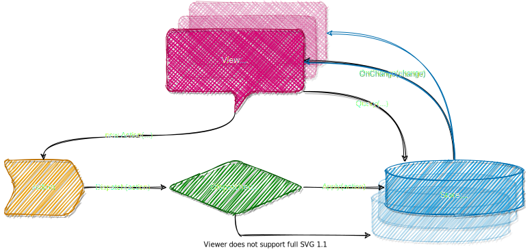

---
<!-- _class: highlight -->
# Redux
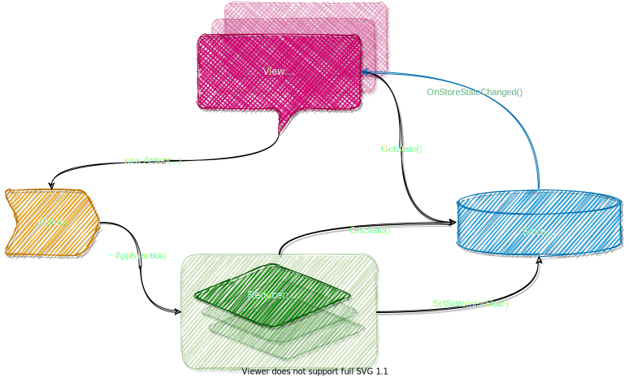

---
<!-- _class: highlight -->
# MVC
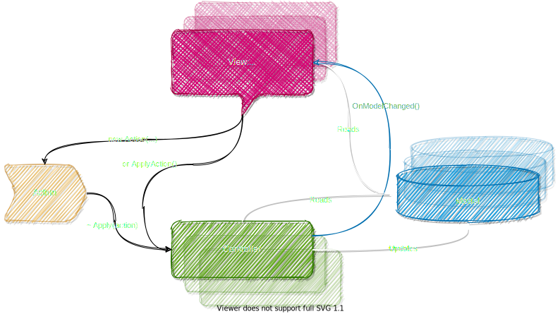

---
<!-- _class: highlight -->
# MVC + KO/MobX
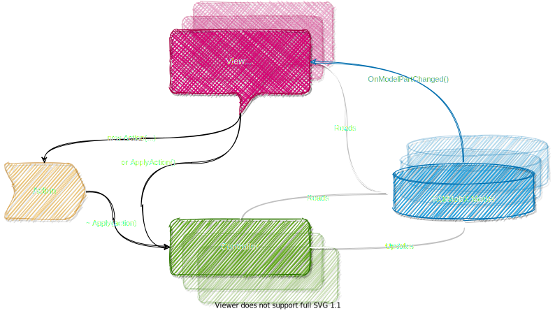

---
<!-- _class: highlight -->
# Fusion
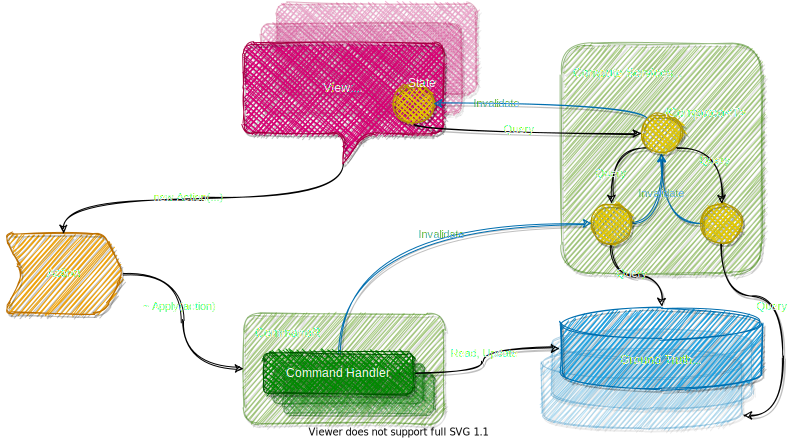

---
<!-- _class: highlight -->
# Fusion
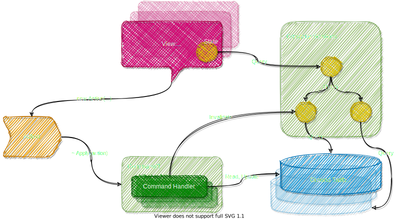

---
<!-- _class: highlight -->
# Fusion
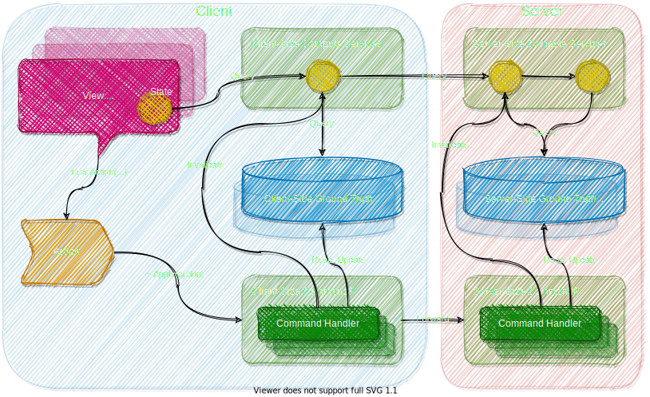

---
<!-- _class: -->

# Fusion vs Flux, Redux, MVC, MobX, ...

🚀 Real-time & caching everywhere
👌 Guaranteed eventual consistency
💃 CQRS, multi-host mode, bells, whistles.

Forget about:
👾 Reducers, stores
🤬 Observable models. Of observable models. 
&nbsp;&nbsp;&nbsp;&nbsp; Of other observable models.
✉ Server-side push notifications

---
<!-- _class: highlight -->


# Fusion and Blazor

👰 WASM
💃 Server
👯 Fusion

Debugging 👰 is 😭, so get 👯!

---
<!-- _class: invert highlight -->


> <span style="color: white">Discovery consists of looking at the same thing as everyone else and thinking something different.</span>
> *― Albert Szent-Gyorgyi*

---


<p style="text-align: center">
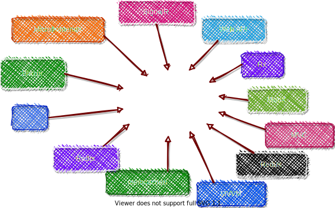
</p>

---
<!-- _class: invert highlight -->

# The price you pay for Fusion

**Money:** thanks to [ServiceTitan](servicetitan.com), Fusion is free (MIT license)

**CPU:** free your CPUs! The torture of making them to run recurring computations again and again must be stopped!

**RAM** is where the price is really paid. So keep this under control, [remember about GC pauses](https://github.com/servicetitan/Stl.Fusion.Samples/blob/master/docs/tutorial/Part08.md#large-working-sets-and-gc-pauses) and check out how Fusion [scales horizontally](https://github.com/servicetitan/Stl.Fusion.Samples/blob/master/docs/tutorial/Part10.md) + supports external caching via ["swapping"](https://github.com/servicetitan/Stl.Fusion.Samples/blob/master/docs/tutorial/Part05.md#caching-options) feature.

**Learning curve:** relatively shallow in the beginning, but getting steeper once you start to dig deeper. ~ Like for TPL with its `ExecutionContext`, `ValueTask<T>`, etc.

**Other risks:** you may really love it.

---

## &nbsp;

If you need a real-time UI or a robust caching, Fusion is probably the lesser of many evils you'll have to fight otherwise.<sup>*</sup>
</br>
</br>

<footer>(*) Fusion creator's opinion, totally unbiased.</footer>

## &nbsp;
## &nbsp;

---
<!-- _class: center invert-->
## Does real-time matter?

---


On a serious note: [Real-Time is #1 Feature Your Next Web App Needs](https://alexyakunin.medium.com/features-of-the-future-web-apps-part-1-e32cf4e4e4f4?sk=65dacdbf670ef9b5d961c4c666e223e2)


---
<!-- _class: -->


> <p style="color: #000">It is not the strongest of the species that survives, nor the most intelligent; 
> it is the one most adaptable to change.</p>
> — Charles Darwin

</br></br></br></br></br></br></br></br></br></br>

---
<!-- _class: highlight -->


---
<!-- _class: highlight -->


---
<!-- _class: highlight -->


---
<!-- _class: center invert-->


<br><br><br><br>
<h2 style="font-size: 60pt">Thank you!</h1>

<footer style="width: 95%; text-align: right; font-size: 20pt; color: white">
Alex Yakunin</br>
The creator of Fusion, <a href="https://www.servicetitan.com/">ServiceTitan, Inc.</a> CTO</br>
<a href="https://github.com/servicetitan/Stl.Fusion">https://github.com/servicetitan/Stl.Fusion</a></br>
P.S. We need your stars and forks!  </br>
</footer>
